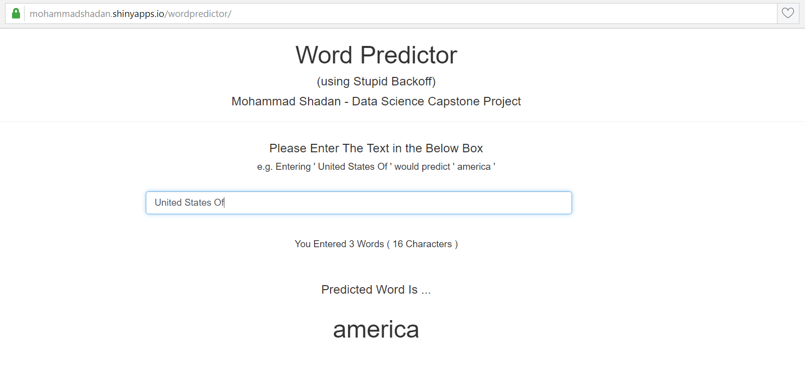

Word Prediction Application    
========================================================
author: MOHAMMAD SHADAN
date: 23-DEC-2016
autosize: true
Coursera - Data Science Capstone Project      
(using Stupid Backoff)

Steps Involved to create the Application
========================================================

- Creating n-grams (n =1, 2, 3, 4 and 5) from random one percent sample of three english text files (en_US.blogs.txt, en_US.news.txt, en_US.twitter.txt) from Coursera [dataset](https://d396qusza40orc.cloudfront.net/dsscapstone/dataset/Coursera-SwiftKey.zip)

- Creating functions to calculate Relative Frequncies (Maximum Liklihood Estimate), Stupid Backoff Score and predict the next word based on maximum score 

- Creating shiny app (ui.R and server.R) and implementing Stupid Backoff Algorithm using above functions

Description of the Stupid Backoff Algorithm
========================================================

To find the score of a word that should appear after a sentence it will first look for context for the word at the n-gram level and if there is no n-gram of that size it will recurse to the (n-1)-gram and multiply its score with 0.4 (alpha).

Mathematically,                $Score = \begin{cases} \frac {freq(w_i)_{n=k+1}} {freq(w_{i-k}^{i-1})_{n=k+1}} & \text{if } freq(w_{i-k}^i)_{n=k+1} > 0 \\ 0.4 \frac {freq(w_i)_{n=k}} {freq(w_{i-(k-1)}^{i-1})_{n=k}} & \text{otherwise} \end{cases}$    

- Stupid Backoff is comparatively computationally inexpensive and accuracy is good     
- Stupid Backoff uses relative frequencies (score)   

Shiny Application - Word Predictor
========================================================    

About the Application    
========================================================

- https://mohammadshadan.shinyapps.io/wordpredictor/     
- User enters the text in the Box and application displays the most probable word below "Predicted Word Is ..." e.g. entering "Cup of" would predict "coffee" 
- If nothing is entered in the text box, the application displays the word "the", as it is the most frequent uni-gram     

__Logic behind Prediction__

- Users inputs a set of words and application fetches the last 4 to 1 words and checks the ngrams for a match    
- All probable words are gathered and the word with maximum score is displayed   

