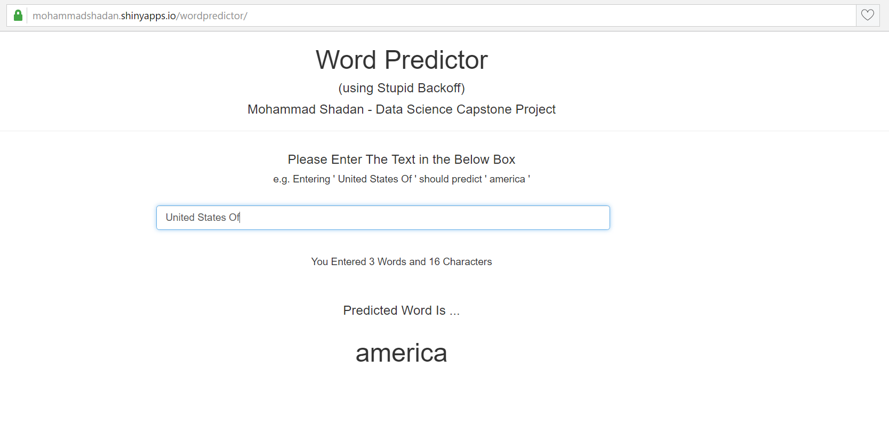

Word Prediction Application    
========================================================
author: MOHAMMAD SHADAN
date: 22-DEC-2016
autosize: true
Coursera - Data Science Capstone Project      
(using Stupid Backoff)

Steps Involved to create the Application
========================================================

Getting and Cleaning Data    
- Loading the [dataset](https://d396qusza40orc.cloudfront.net/dsscapstone/dataset/Coursera-SwiftKey.zip) as provided by Coursera
- Taking a random one percent sample of the three files (en_US.blogs.txt, en_US.news.txt, en_US.twitter.txt) and combining them    
- Creating and Cleaning the Corpus, convert to lower case and exlude punctuations, numbers, unwanted characters and extra spaces
- Creating Term Document Matrix     
- Creating ngrams (n =1, 2, 3, 4 and 5) and saving them as separate RDS files to be refered later by the shiny application

    
Steps Involved to create the Application - Continued
========================================================

Writing Functions to Clean Phrase and extract last n words of the Phrase entered by user

Prediction Model
- Creating Maximum Liklihood Estimate based on the last n words of phrase and ngrams
- Calculating Stupid Backoff Score using Stupid Backoff Algorithm
- Doing word prediction based of maximum Stupid Backoff Score

Creating shiny app (ui.R and server.R) and implementing prediction model

Description of the Stupid Backoff Algorithm
========================================================

To find the score of a word that should appear after a sentence it will first look for context for the word at the n-gram level and if there is no n-gram of that size it will recurse to the (n-1)-gram and multiply its score with 0.4 (alpha) and keep recursing (also multipling the score again by 0.4) if no match found.

Mathematically, 

$Score = \begin{cases} \frac {freq(w_i)_{n=k+1}} {freq(w_{i-k}^{i-1})_{n=k+1}} & \text{if } freq(w_{i-k}^i)_{n=k+1} > 0 \\ 0.4 \frac {freq(w_i)_{n=k}} {freq(w_{i-(k-1)}^{i-1})_{n=k}} & \text{otherwise} \end{cases}$    

- Stupid Backoff is comparatively computationally inexpensive and accuracy is good     
- Stupid Backoff uses relative frequencies (score)   

Shiny Application - Word Predictor
========================================================    

About the Application    
========================================================

https://mohammadshadan.shinyapps.io/wordpredictor/

**How the use the Application**
- User should enter the text in the Box and application displays the most probable word below "Predicted Word Is ..."
- If nothing is entered in the text box, the application displays the word "the"

**How the Application does the Prediction**
- Users input a set of words     
- Application fetches the last 4 to 1 words and checks the ngrams for a match    
- All probable words are gathered and the word with maximum score is displayed   

