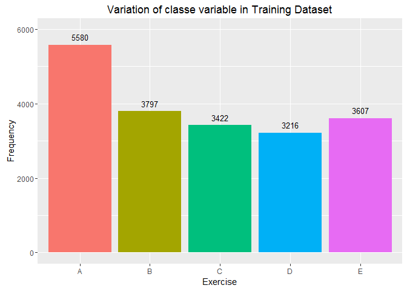
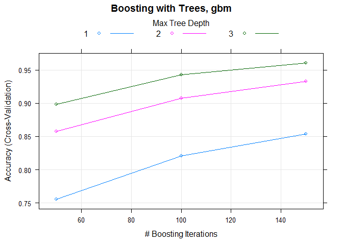
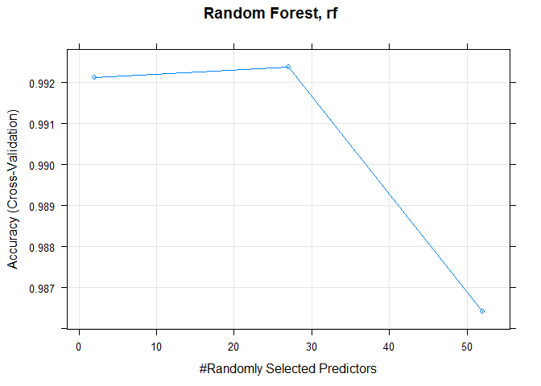
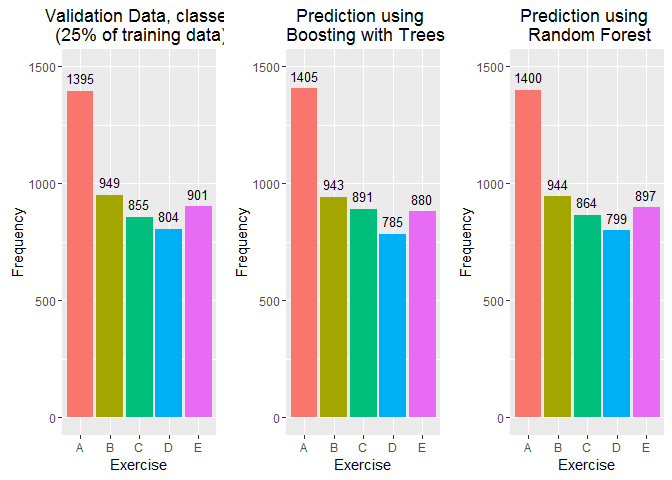

# Practical Machine Learning Course Project
MOHAMMAD SHADAN  
September 21, 2016  

###TABLE OF CONTENT    
- Executive Summary     
- Loading Trainig and Test Data     
- Exploratory Data Analysis     
- Data Processing and Cleaning Data       
    - Removing Zero Covariates      
    - Removing Columns with 90 % missing Values      
- Cross Validation        
- Traning the Models (Boosting with Trees, Random Forest)      
- Check the prediction models on Validation Dataset    
- Model Comparison (Accuracy and Out of Sample Error)  
- Prediction on Testing Dataset (20 different test cases)   
- Result       

###EXECUTIVE SUMMARY   
Six young health participants aged between 20-28 years, with little weight lifting experience were asked to perform one set of 10 repetitions of the Unilateral Dumbbell Biceps Curl in five different fashions and was measured using fitness device which the subject wore :        
- Class A : exactly according to the specification   
- Class B : throwing the elbows to the front   
- Class C : lifting the dumbbell only halfway   
- Class D : lowering the dumbbell only halfway   
- Class E : throwing the hips to the front   

The goal of the project is to choose and train the prediction models on training data and predict the manner in which the subjects did the exercise for 20 different test cases.    

The data for this project come from the [source](http://groupware.les.inf.puc-rio.br/har) and is licensed under the Creative Commons License (CC BY-SA).    


###LOADING DATA

- Training Dataset can be downloaded from the [URL](https://d396qusza40orc.cloudfront.net/predmachlearn/pml-training.csv)    
- Testing Dataset can be downloaded from the [URL](https://d396qusza40orc.cloudfront.net/predmachlearn/pml-testing.csv)     
- Move the Training and Testing dataset to the Working Directory     


```r
#Setup the working directory and copy the required training and test datasets
#setwd("~/GitHub/practicalmachinelearning/")

#Load the requied libraries
library(caret); library(ggplot2); library(gridExtra); library(plyr);
library(randomForest); library(splines); library(rpart); library(plyr);
library(parallel); library(doParallel)
```


```r
set.seed(825)
#Loading the data assuming Missing Values and Uncomputable values as NA
data_training <- read.csv("pml-training.csv", na.strings = c("#DIV/0!", "NA",""))
data_testing <- read.csv("pml-testing.csv", na.strings = c("#DIV/0!", "NA",""))

# If you don't want to download the datasets manually use the below queries
# training_url  <- "https://d396qusza40orc.cloudfront.net/predmachlearn/pml-training.csv"
# testing_url   <- "https://d396qusza40orc.cloudfront.net/predmachlearn/pml-testing.csv"
# data_training <- read.csv(training_url, na.strings = c("#DIV/0!", "NA",""))
# data_testing  <- read.csv(testing_url, na.strings = c("#DIV/0!", "NA",""))
```
###Exploratory Data Analysis

Dimensions of Training Data Set     

```
## [1] 19622   160
```

Dimensions of Testing Data Set    

```
## [1]  20 160
```

Checking for mismatch in column names in both the original training and testing datasets

```r
mismatch_all <- which(names(data_training)!=names(data_testing))
```

```
## Mismatch of Column Names is in Column Number   : 160 
## Mismatched Training Data Set Column Name       : classe 
## Mismatched Testing Data Set Column Name        : problem_id
```

`classe` is the variable on which we will build our prediction model  

```r
exer_count <- data.frame(table(data_training$classe))
names(exer_count) <- c("Exercise", "Frequency")
table(data_training$classe)
```

```
## 
##    A    B    C    D    E 
## 5580 3797 3422 3216 3607
```

<!-- -->

###DATA PROCESSING AND CLEANING DATA

####Removing Zero Covariates   
Some variables have no variability at all. These variables are not useful when we want to construct a prediction model. When nzv = TRUE, those variables can be removed from the model

```r
#Creating new datasets training_all and testing after removing Near Zero Variables

#Removing the nearZeroVar (TRUE) variables from the train dataset
training_all <- data_training[, -nearZeroVar(data_training)]

#Removing the same variable which were removed from the train dataset from the test dataset also
testing <- data_testing[, -nearZeroVar(data_training)]
```

####Removing Columns with more than 90 % missing values    
Removing variables (Columns) which have 90 percent NA or missing values and keeping the required columns for better prediction     


```r
#Finding column numbers which have more than 90 percent missing values
col_90NA <- which(colSums(is.na(training_all))/nrow(training_all) > .9,arr.ind=TRUE)

# Removing the above columns from the training and testing data sets
training_all <- training_all[, -col_90NA]
testing      <- testing[, -col_90NA]
```

####Removing other non useful columns which won't affect the prediction    

```r
# Removing columns X, user_name, raw_timestamp_part_1, raw_timestamp_part_2, cvtd_timestamp, num_window
# Initially I didn't remove these columns but model gave wiered results for "gbm" so removing these
# unwanted columns

training_all <- training_all[, -c(1:6)]
testing      <- testing[, -c(1:6)]
```

Dimensions of the **cleaned** Training Dataset      

```
## [1] 19622    53
```

Dimensions of the **cleaned** Testing Dataset    

```
## [1] 20 53
```

Veryfying the Column Name Mismatch. There should be one column mismatch    

```
## Mismatch of Column Names is in Column Number   : 53 
## Mismatched Training Data Set Column Name       : classe 
## Mismatched Testing Data Set Column Name        : problem_id
```

###CROSS VALIDATION
Since the training data set has 19,622 observations so this data set will be divided into two datsets "training" and "validation". Firstly we will train the model on training data set and do the testing on validation dataset to check the accuracy.    

Splitting the cleaned training dataset (`training_all`) into two datasets, `training` (75 %) and`validation` (remaining 25 %).   

Thus we will have 3 datasets to work on, namely :   
1. `training`   : it has 75 % of the cleaned training data     
2. `validation` : it has 25 % of the cleaned training data    
3. `testing`    : cleaned testing dataset on which final prediction will be done as per the assignment    


```r
## Create training set indexes with 75% of cleaned training data
inTrain <- createDataPartition(y=training_all$classe,p=0.75, list=FALSE)
# Subset training_all data to training (75%)
training <- training_all[inTrain,]
# Subset training_all data (the rest) to validation (25%)
validation <- training_all[-inTrain,]
```

###TRAINING THE MODELS (Boosting with Trees, Random Forest)    

I will be using `Boosting With Trees` ("gbm") and `Random Forest` ("rf") as prediction models and will do the testing on the validation data set for accuracy.   

The model which give better results will be used to do the prediction on the final `testing` data set

Step 1: Configure parallel processing

```r
cluster <- makeCluster(detectCores() - 1) # convention to leave 1 core for OS
registerDoParallel(cluster)
```
Step 2: Configure trainControl object

```r
fitControl <- trainControl(method = "cv", number = 10, allowParallel = TRUE)
```

Step 3: Develop training model    

Boosting with Trees (gbm)     

```r
#Training model using Boosting with Trees and monitoring time taken for execution
start_time_gbm <- Sys.time()
fit_gbm <- caret::train(classe ~ ., method="gbm",data=training ,trControl = fitControl)
end_time_gbm <- Sys.time()
```

Random Forest (rf)    

```r
#Training model using Random Forest and monitoring time taken for execution
start_time_rf <- Sys.time()
fit_rf <- caret::train(classe ~ ., method="rf",data=training ,trControl = fitControl)
end_time_rf <- Sys.time()
```

Step 4: De-register parallel processing cluster

```r
stopCluster(cluster)
```

###CHECK THE PREDICTION MODELS ON VALIDATION DATASET

####Validation using Boosting with Trees (gbm)

```r
#Most important variables as predicted by gbm
varImp(fit_gbm)
```

```
## gbm variable importance
## 
##   only 20 most important variables shown (out of 52)
## 
##                   Overall
## roll_belt         100.000
## pitch_forearm      49.067
## magnet_dumbbell_z  36.069
## yaw_belt           34.376
## magnet_dumbbell_y  26.149
## roll_forearm       26.030
## magnet_belt_z      17.419
## gyros_belt_z       17.368
## roll_dumbbell      15.025
## pitch_belt         13.481
## accel_forearm_x    12.320
## magnet_forearm_z   11.036
## gyros_dumbbell_y   10.429
## accel_dumbbell_y    9.755
## accel_dumbbell_x    7.903
## magnet_dumbbell_x   7.219
## yaw_arm             7.206
## magnet_arm_z        6.569
## magnet_belt_y       5.329
## roll_arm            4.837
```

```r
#Plotting Accuracy vs. Randomly Selected Predictors
plot(fit_gbm, main="Boosting with Trees, gbm")
```

<!-- -->

```r
#Testing the Boosting with Trees Prediction Model on validation dataset
prediction_gbm <- predict(fit_gbm,newdata=validation[,-53])

#Confusion Matrix for Boosting with Trees
confusionMatrix(prediction_gbm, validation$classe)
```

```
## Confusion Matrix and Statistics
## 
##           Reference
## Prediction    A    B    C    D    E
##          A 1372   33    0    0    0
##          B   14  892   14    6   17
##          C    4   21  830   28    8
##          D    4    2    9  758   12
##          E    1    1    2   12  864
## 
## Overall Statistics
##                                           
##                Accuracy : 0.9617          
##                  95% CI : (0.9559, 0.9669)
##     No Information Rate : 0.2845          
##     P-Value [Acc > NIR] : < 2.2e-16       
##                                           
##                   Kappa : 0.9515          
##  Mcnemar's Test P-Value : 7.16e-07        
## 
## Statistics by Class:
## 
##                      Class: A Class: B Class: C Class: D Class: E
## Sensitivity            0.9835   0.9399   0.9708   0.9428   0.9589
## Specificity            0.9906   0.9871   0.9849   0.9934   0.9960
## Pos Pred Value         0.9765   0.9459   0.9315   0.9656   0.9818
## Neg Pred Value         0.9934   0.9856   0.9938   0.9888   0.9908
## Prevalence             0.2845   0.1935   0.1743   0.1639   0.1837
## Detection Rate         0.2798   0.1819   0.1692   0.1546   0.1762
## Detection Prevalence   0.2865   0.1923   0.1817   0.1601   0.1794
## Balanced Accuracy      0.9871   0.9635   0.9778   0.9681   0.9775
```

```r
#Accuracy and Kappa for Boosting with Trees
ak_gbm <- postResample(prediction_gbm, validation$classe)
```

####Validation using Random Forest (rf)


```r
##Most important variables as predicted by Random Forest
varImp(fit_rf)
```

```
## rf variable importance
## 
##   only 20 most important variables shown (out of 52)
## 
##                      Overall
## roll_belt            100.000
## pitch_forearm         60.088
## yaw_belt              53.079
## roll_forearm          45.232
## pitch_belt            44.134
## magnet_dumbbell_z     43.541
## magnet_dumbbell_y     42.900
## accel_dumbbell_y      22.784
## roll_dumbbell         18.624
## magnet_dumbbell_x     18.099
## accel_forearm_x       18.060
## magnet_forearm_z      15.293
## accel_dumbbell_z      14.659
## accel_belt_z          14.618
## magnet_belt_z         14.562
## magnet_belt_y         13.389
## total_accel_dumbbell  12.994
## gyros_belt_z          11.644
## yaw_arm               10.512
## magnet_belt_x          9.808
```

```r
#Plotting Accuracy vs. Randomly Selected Predictors
plot(fit_rf, main="Random Forest, rf")
```

<!-- -->

```r
#Testing the Random Forest Prediction Model on validation dataset
prediction_rf <- predict(fit_rf,newdata=validation[,-53])

#Confusion Matrix  for Random Forest
confusionMatrix(prediction_rf, validation$classe)
```

```
## Confusion Matrix and Statistics
## 
##           Reference
## Prediction    A    B    C    D    E
##          A 1392    8    0    0    0
##          B    2  939    1    1    1
##          C    0    1  852   10    1
##          D    0    1    2  792    4
##          E    1    0    0    1  895
## 
## Overall Statistics
##                                           
##                Accuracy : 0.9931          
##                  95% CI : (0.9903, 0.9952)
##     No Information Rate : 0.2845          
##     P-Value [Acc > NIR] : < 2.2e-16       
##                                           
##                   Kappa : 0.9912          
##  Mcnemar's Test P-Value : NA              
## 
## Statistics by Class:
## 
##                      Class: A Class: B Class: C Class: D Class: E
## Sensitivity            0.9978   0.9895   0.9965   0.9851   0.9933
## Specificity            0.9977   0.9987   0.9970   0.9983   0.9995
## Pos Pred Value         0.9943   0.9947   0.9861   0.9912   0.9978
## Neg Pred Value         0.9991   0.9975   0.9993   0.9971   0.9985
## Prevalence             0.2845   0.1935   0.1743   0.1639   0.1837
## Detection Rate         0.2838   0.1915   0.1737   0.1615   0.1825
## Detection Prevalence   0.2855   0.1925   0.1762   0.1629   0.1829
## Balanced Accuracy      0.9978   0.9941   0.9968   0.9917   0.9964
```

```r
#Accuracy and Kappa for Random Forest
ak_rf <- postResample(prediction_rf, validation$classe)   
```

###Plot comparing the two prediction models with validation data for classe variable

<!-- -->

####Time taken for Execution of Prediction Training Models

```
## Boosting with Trees       : 4.852641 
## Random Forest             : 16.06908
```

####Accuracy of Models

```
## Boosting with Trees       : 0.9616639 
## Random Forest             : 0.9930669
```

####Out of Sample Errors (1 - Accuracy)

```
## Boosting with Trees       : 0.03833605 
## Random Forest             : 0.006933116
```
As can be confirmed by the Accuracy and Out of Sample Error, Random Forest (rf) does better prediction as compared to Boosting with Trees (gbm) but takes more time for execution.   

###PREDICTION ON TESTING DATASET    
Prediction on the provided `testing` dataset as per the Assignment.    
Using Random Forest as it is more accurate     

```r
prediction <- predict(fit_rf,newdata=testing[,-53])
```

###RESULT
Using Random Forest, corresponding values (Class) of `problem_id` in the testing dataset are as below :

```r
cbind(testing$problem_id, data.frame(prediction))
```

```
##    testing$problem_id prediction
## 1                   1          B
## 2                   2          A
## 3                   3          B
## 4                   4          A
## 5                   5          A
## 6                   6          E
## 7                   7          D
## 8                   8          B
## 9                   9          A
## 10                 10          A
## 11                 11          B
## 12                 12          C
## 13                 13          B
## 14                 14          A
## 15                 15          E
## 16                 16          E
## 17                 17          A
## 18                 18          B
## 19                 19          B
## 20                 20          B
```
     
###THANK YOU   
