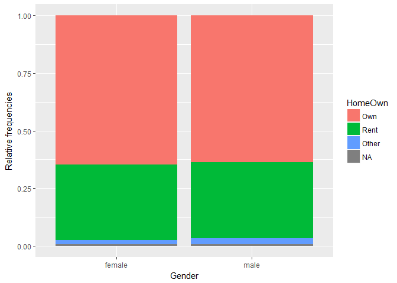
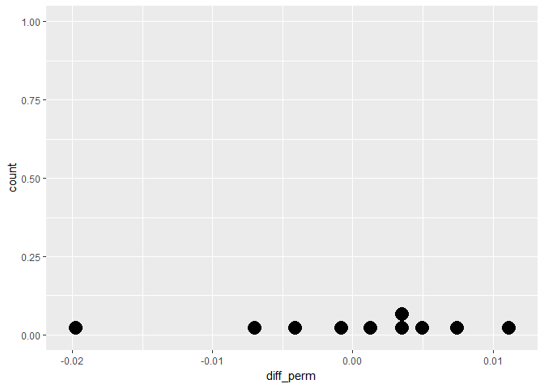
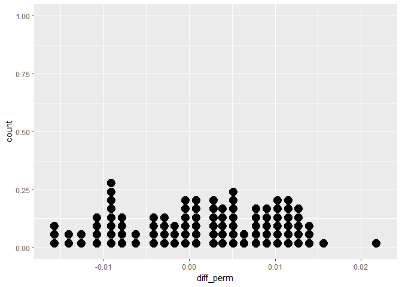
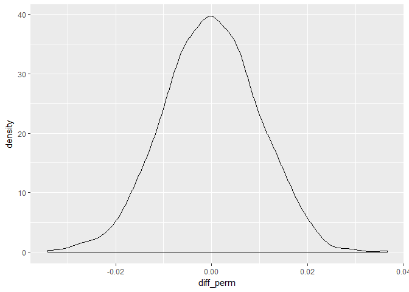
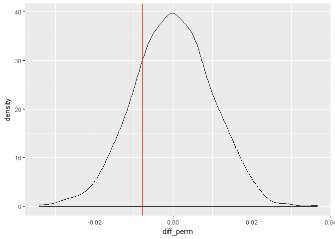
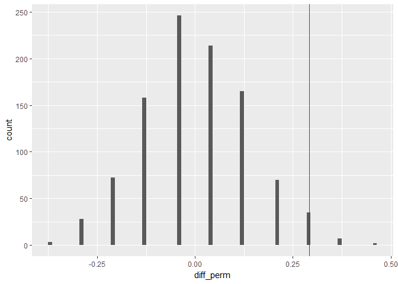

# Foundation of Inference
MOHAMMAD SHADAN  
April 22, 2017  

# 1. Introduction to ideas of inference 

## Welcome to the course!

### Hypotheses (1)

Consider drug A for diabetes that a pharmaceutical company is trying to pass through the FDA. Currently, most doctors prescribe drug B to treat diabetes.

Which would be a good null hypothesis?

Possible Answers
- Drug A is better than drug B at treating diabetes.
- Drug A is worse than drug B at treating diabetes.
- Drug A is different than drug B at treating diabetes (but you don't know if it is better or worse).
- Drug A is the same as drug B at treating diabetes. (Correct)


### Hypotheses (2)

Consider the same situation as in the last exercise. A pharmaceutical company is trying to pass drug A for diabetes through the FDA, but most doctors currently prescribe drug B.

Which would be a good alternative hypothesis?

Possible Answers
Drug A is better than drug B at treating diabetes.
Drug A is worse than drug B at treating diabetes.
Drug A is different than drug B at treating diabetes (but you don't know if it is better or worse).
Drug A is the same as drug B at treating diabetes.

The alternative hypothesis corresponds to the research question of interest, in this case whether drug A is more effective at treating diabetes than drug B.

## Randomized distributions - Video

### Working with the NHANES data

Throughout this chapter, you will use the NHANES dataset from the NHANES R package. These data are collected by the CDC and can be thought of as a random sample of US residents.

Before moving on to investigate particular variables, you'll have an opportunity to briefly explore the data in this exercise.

Instructions
 - Load the dplyr, ggplot2, and NHANES packages, one at a time.
 - Use the names() function to list the variables included in NHANES. (See ?NHANES for more info.)
 - Create a barplot for HomeOwn broken down by Gender. Use geom_bar(position = "fill") to compare relative frequencies.
 - Create a density plot for SleepHrsNight colored by SleepTrouble and faceted by HealthGen.
 - Note that because of the discrete nature of the data collection, the density should be smoothed a bit using adjust = 2.
 - Use facet_wrap(~ HealthGen) for the faceting, which will make it easier to visualize how the variables of interest vary by.
 
 
 

```r
# Load packages
library(dplyr)
```

```
## 
## Attaching package: 'dplyr'
```

```
## The following objects are masked from 'package:stats':
## 
##     filter, lag
```

```
## The following objects are masked from 'package:base':
## 
##     intersect, setdiff, setequal, union
```

```r
library(ggplot2)
library(NHANES)
#install.packages("NHANES")

# What are the variables in the NHANES dataset?
names(NHANES)
```

```
##  [1] "ID"               "SurveyYr"         "Gender"          
##  [4] "Age"              "AgeDecade"        "AgeMonths"       
##  [7] "Race1"            "Race3"            "Education"       
## [10] "MaritalStatus"    "HHIncome"         "HHIncomeMid"     
## [13] "Poverty"          "HomeRooms"        "HomeOwn"         
## [16] "Work"             "Weight"           "Length"          
## [19] "HeadCirc"         "Height"           "BMI"             
## [22] "BMICatUnder20yrs" "BMI_WHO"          "Pulse"           
## [25] "BPSysAve"         "BPDiaAve"         "BPSys1"          
## [28] "BPDia1"           "BPSys2"           "BPDia2"          
## [31] "BPSys3"           "BPDia3"           "Testosterone"    
## [34] "DirectChol"       "TotChol"          "UrineVol1"       
## [37] "UrineFlow1"       "UrineVol2"        "UrineFlow2"      
## [40] "Diabetes"         "DiabetesAge"      "HealthGen"       
## [43] "DaysPhysHlthBad"  "DaysMentHlthBad"  "LittleInterest"  
## [46] "Depressed"        "nPregnancies"     "nBabies"         
## [49] "Age1stBaby"       "SleepHrsNight"    "SleepTrouble"    
## [52] "PhysActive"       "PhysActiveDays"   "TVHrsDay"        
## [55] "CompHrsDay"       "TVHrsDayChild"    "CompHrsDayChild" 
## [58] "Alcohol12PlusYr"  "AlcoholDay"       "AlcoholYear"     
## [61] "SmokeNow"         "Smoke100"         "Smoke100n"       
## [64] "SmokeAge"         "Marijuana"        "AgeFirstMarij"   
## [67] "RegularMarij"     "AgeRegMarij"      "HardDrugs"       
## [70] "SexEver"          "SexAge"           "SexNumPartnLife" 
## [73] "SexNumPartYear"   "SameSex"          "SexOrientation"  
## [76] "PregnantNow"
```

```r
# Create bar plot for Home Ownership by Gender
ggplot(NHANES, aes(x = Gender, fill = HomeOwn)) + 
  geom_bar(position = "fill") +
  ylab("Relative frequencies")
```

<!-- -->

```r
# Density for SleepHrsNight colored by SleepTrouble, faceted by HealthGen
ggplot(NHANES, aes(x =  SleepHrsNight, col = SleepTrouble)) + 
  geom_density(adjust=2) + 
  facet_wrap(~HealthGen)
```

```
## Warning: Removed 2245 rows containing non-finite values (stat_density).
```

<!-- -->

Notice that the warning message for the densities and the grey portions of the bars both indicate a large number of missing observations in the dataset. If this were your dataset, it would be important to stop here and consider the cause of the missingness. For the course, we will now proceed without worrying about the missing observations.    


```r
#Testing
dim(NHANES)
```

```
## [1] 10000    76
```


### Randomly allocating samples

As seen in the video, you will now use R to randomly permute the observations and calculate a difference in proportions that could arise from a null distribution.

Using the NHANES dataset, let's investigate the relationship between gender and home ownership. Type ?NHANES in the console to get a description of its variables.

Instructions
The dplyr, ggplot2, and NHANES packages have been loaded for you.

- Subset the NHANES dataset to consider only individuals whose home ownership status is either "Own" or "Rent". Save the result to homes.
- Perform a single permutation to evaluate whether home ownership status (i.e. HomeOwn) differs between the "female" and "male" groups:
- In your mutate() call, use sample() to shuffle home ownership status. Call this new variable HomeOwn_perm, a permuted version of HomeOwn.
Group by Gender.
- In both the original data and in the permuted data, compute the proportion of individuals who own a home. Note that this will calculate proportions for both genders since you've grouped by the Gender variable in the line before it.
- Using the diff() function, calculate the difference in proportion of home ownership for both prop_own_perm, the permuted data, and prop_own, the original data.


```r
# Subset the data: homes
homes <- NHANES %>%
  select(Gender, HomeOwn) %>%
  filter(HomeOwn %in% c("Own", "Rent"))

# Perform one permutation 
homes %>%
  mutate(HomeOwn_perm = sample(HomeOwn)) %>%
  group_by(Gender) %>%
  summarize(prop_own_perm = mean(HomeOwn_perm == "Own"), 
            prop_own = mean(HomeOwn == "Own")) %>%
  summarize(diff_perm = diff(prop_own_perm),
            diff_orig = diff(prop_own))
```

```
## # A tibble: 1 x 2
##      diff_perm    diff_orig
##          <dbl>        <dbl>
## 1 -0.007828723 -0.007828723
```

Keep in mind, this is just a single random permutation. Next, you'll look at several permuted differences to see how they compare with the observed difference.


### Randomization dotplot (n = 10)

As you saw in the video, natural variability can be modeled from shuffling observations around to remove any relationships that might exist in the population. This is done with the rep_sample_n() function from the oilabs package. Within it, you must specify arguments for the data (tbl), the sample size, the number of samples to take (reps), and whether sampling should be done with or without replacement (replace). The output includes a new column, replicate, which indicates the sample number. For example,

homes %>% 
  rep_sample_n(size = 5, reps = 3)
will return three samples of 5 observations from the homes dataset you created in the last exercise. The first 5 rows will have a value of 1 in the replicate column, the next 5 rows will have a value of 2, and so on. Note that the default value for the replace argument is FALSE.

In this exercise, you will permute the home ownership variable 10 times. By doing so, you will ensure that there is no relationship between home ownership and gender, so any difference in home ownership proportion for female versus male will be due only to natural variability.

Instructions     
 - The dplyr, ggplot2, NHANES, and oilabs packages have been loaded for you and the homes dataset you created in the last exercise is available in your workspace.
 - Using rep_sample_n(), repeat the permutation process from the last exercise to get 10 null differences in proportions (i.e. reps = 10) using all observations in the homes dataset. Assign the result to homeown_perm.
 - Print the permuted differences in homeown_perm to the console.
 - Using geom_dotplot(), plot the differences in proportions obtained by shuffling the HomeOwn variable. Adjust the size of the dots by including binwidth = .001 in your call to geom_dotplot().


```r
library(devtools)
#devtools::install_github("andrewpbray/oilabs")
library(oilabs)
```


```r
library(oilabs)
# Perform 10 permutations
homeown_perm <- homes %>%
  rep_sample_n(size = nrow(homes), reps = 10) %>%
  mutate(HomeOwn_perm = sample(HomeOwn)) %>%
  group_by(replicate,Gender) %>%
  summarize(prop_own_perm = mean(HomeOwn_perm == "Own"), 
            prop_own = mean(HomeOwn == "Own")) %>%
  summarize(diff_perm = diff(prop_own_perm),
            diff_orig = diff(prop_own)) # male - female

# Print differences to console
print(homeown_perm)
```

```
## # A tibble: 10 x 3
##    replicate     diff_perm    diff_orig
##        <int>         <dbl>        <dbl>
## 1          1  0.0037039676 -0.007828723
## 2          2  0.0074109038 -0.007828723
## 3          3  0.0111178401 -0.007828723
## 4          4  0.0032920858 -0.007828723
## 5          5  0.0012326767 -0.007828723
## 6          6 -0.0197732954 -0.007828723
## 7          7  0.0049396130 -0.007828723
## 8          8 -0.0008267323 -0.007828723
## 9          9 -0.0041217867 -0.007828723
## 10        10 -0.0070049594 -0.007828723
```

```r
# Dotplot of 10 permuted differences in proportions
ggplot(homeown_perm, aes(x = diff_perm)) + 
  geom_dotplot(binwidth = 0.001)
```

<!-- -->

From the dotplot, it's still hard to get an idea of what the null distribution looks like. You'll repeat the process with 100 permutations in the next exercise. Awesome job!

### Randomization dotplot (n = 100)

By permuting the home ownership variable multiple times, you generate differences in proportions when in fact the variables are not at all related.

Instructions   
    - The dplyr, ggplot2, NHANES, and oilabs packages have been loaded for you. Repeat the permuting and plotting with 100 differences in proportions generated by shuffling the HomeOwn variable. Adjust the size of the dots by including binwidth = .001 in your call to geom_dotplot().


```r
# Perform 100 permutations
homeown_perm <- homes %>%
  rep_sample_n(size = nrow(homes), reps = 100) %>%
  mutate(HomeOwn_perm = sample(HomeOwn)) %>%
  group_by(replicate,Gender) %>%
  summarize(prop_own_perm = mean(HomeOwn_perm == "Own"),
            prop_own = mean(HomeOwn == "Own")) %>%
  summarize(diff_perm = diff(prop_own_perm),
            diff_orig = diff(prop_own)) # male - female

# Dotplot of 100 permuted differences in proportions
ggplot(homeown_perm, aes(x = diff_perm)) + 
  geom_dotplot(binwidth = 0.001)
```

<!-- -->

 It's much easier to get a feel for the distribution now. In the next exercise, you'll see how 1000 permutations are distributed.
 
### Randomization density

Using 100 repetitions allows you to understand the mechanism of permuting. However, 100 is not enough to observe the full range of likely values for the null differences in proportions.

In this exercise, you'll repeat the process 1000 times to get a sense for the complete distribution of null differences in proportions.

Instructions     
The dplyr, ggplot2, NHANES, and oilabs packages have been loaded for you.

  - Generate 1000 differences in proportions by shuffling the HomeOwn variable and following the same procedure as before.
  - Use geom_density() to create a smoothed visual representation of the distribution of differences.
    

```r
# Perform 1000 permutations
homeown_perm <- homes %>%
  rep_sample_n(size = nrow(homes), reps = 1000) %>%
  mutate(HomeOwn_perm = sample(HomeOwn)) %>%
  group_by(replicate,Gender) %>%
  summarize(prop_own_perm = mean(HomeOwn_perm == "Own"),
            prop_own = mean(HomeOwn == "Own")) %>%
  summarize(diff_perm = diff(prop_own_perm),
            diff_orig = diff(prop_own)) # male - female

# Density plot of 1000 permuted differences in proportions
ggplot(homeown_perm, aes(x = diff_perm)) + 
  geom_density()
```

<!-- -->
You can now see that the distribution is approximately normally distributed around -0.01, but what can we conclude from it? You'll learn how to use this distribution in the next video.

## Using the randomization distribution

Do the data come from the population?
100xp
Recall that the observed difference (i.e. the difference in proportions in the homes dataset, shown as the red vertical line) was around -0.0078, which seems to fall below the bulk of the density of shuffled differences. It is important to know, however, whether any of the randomly permuted differences were as extreme as the observed difference.

In this exercise, you'll re-create this dotplot as a density plot and count the number of permuted differences that were to the left of the observed difference.

Instructions    
The homeown_perm dataset is available in your workspace.     
    - Using geom_density(), plot the permuted differences. Add a vertical red line with geom_vline() where the observed statistic falls.
    - Count the number of permuted differences that were lower than or equal to the observed difference.
    
    
    

```r
# Plot permuted differences
ggplot(homeown_perm, aes(x =diff_perm)) + 
  geom_density() +
  geom_vline(aes(xintercept = diff_orig),
          col = "red")
```

<!-- -->

```r
# Compare permuted differences to observed difference
homeown_perm %>%
  summarize(sum(diff_orig >= diff_perm))
```

```
## # A tibble: 1 x 1
##   sum(diff_orig >= diff_perm)
##                         <int>
## 1                         222
```


212 permuted differences are more extreme than the observed difference. This only represents 21.2% of the null statistics, so you can conclude that the observed difference is consistent with the permuted distribution.


### What can you conclude?

What can you conclude from the analysis?

Possible Answers     
    - We have learned that being female causes people to buy houses.
    - We have learned that our data is consistent with the hypothesis of no difference in home ownership across gender. (Correct)
    - We have learned that the observed difference (from the data) in proportion of home ownership across gender is due to something other than random variation.

# 2. Completing a randomization test: gender discrimination 

## Example: gender discrimination - Video

### Gender discrimination hypotheses

Which of the following null (H0H0) and alternative (HAHA) hypotheses are appropriate for the gender discrimination example described in the previous video?

Possible Answers
- H0H0: gender and promotion are unrelated variables. (Correct)
- HAHA: men are more likely to be promoted. (Correct)
- H0H0: gender and promotion are unrelated variables.
- HAHA: women are more likely to be promoted.
- H0H0: men are more likely to be promoted.
- HAHA: gender and promotion are unrelated variables.
- H0H0: women are more likely to be promoted.
- HAHA: gender and promotion are unrelated variables.


### Summarizing gender discrimination

As the first step of any analysis, you should look at and summarize the data. Categorical variables are often summarized using proportions, and it is always important to understand the denominator of the proportion.

Do you want the proportion of women who were promoted or the proportion of promoted individuals who were women? Here, you want the first of these, so in your R code it's necessary to group_by() the sex variable.

Instructions

The discrimination study data are available in your workspace as disc.

- Using the table() function, summarize the data as a contingency table.
- Summarize the data by using group_by() on the sex variable and finding the proportion who were promoted. Call this variable promoted_prop. Note that with binary variables, the proportion of either value can be found using the mean() function (e.g. mean(variable == "value")).


```r
disc <- read.table("disc.txt", header = TRUE)
head(disc)
```

```
##    promote  sex
## 1 promoted male
## 2 promoted male
## 3 promoted male
## 4 promoted male
## 5 promoted male
## 6 promoted male
```

```r
tail(disc)
```

```
##         promote    sex
## 43 not_promoted female
## 44 not_promoted female
## 45 not_promoted female
## 46 not_promoted female
## 47 not_promoted female
## 48 not_promoted female
```


```r
# Create a contingency table summarizing the data
table(disc)

# Find proportion of each sex who were promoted
disc %>% group_by(sex) %>% summarize(promoted_prop = mean(promote == "promoted"))
```

Okay, so the difference in proportions promoted is almost 0.3. Great work!

### Step-by-step through the permutation

To help you understand the code used to create the randomization distribution, this exercise will walk you through each step, one at a time.

Remember that when using the pipe notation (%>%) with so-called tidy functions like mutate() and summarize() from the dplyr package, each input is a data frame and each output is also a data frame. To keep the output manageable, we will use only 5 replicates here.

Instructions

The dplyr and oilabs packages have been loaded for you, along with the disc data frame from the last exercise. Note that in each step in this exercise, you will simply print the result to the screen (and not save it).

- Use the rep_sample_n() function from the oilabs package to create a data frame by sampling the entire disc data frame 5 times.
- Within each of the 5 replicates of the original data, shuffle the promote variable to break any relationship between promotion and gender.
- Building on the previous data frame, group by replicate and sex then find the proportion of individuals promoted in each grouped category.
- Continuing, find the difference in proportion of "promoted" across sex grouped by replicate.


```r
# Sample the entire data frame 5 times
disc %>%
  rep_sample_n(size = nrow(disc), reps = 5) 
```

```
## Source: local data frame [240 x 3]
## Groups: replicate [5]
## 
##    replicate      promote    sex
## *      <int>       <fctr> <fctr>
## 1          1 not_promoted female
## 2          1     promoted female
## 3          1     promoted   male
## 4          1     promoted female
## 5          1     promoted   male
## 6          1     promoted   male
## 7          1     promoted   male
## 8          1     promoted   male
## 9          1     promoted female
## 10         1 not_promoted   male
## # ... with 230 more rows
```

```r
# Shuffle the promote variable within replicate
disc %>%
  rep_sample_n(size = nrow(disc), reps = 5) %>%
  mutate(prom_perm = sample(promote)) 
```

```
## Source: local data frame [240 x 4]
## Groups: replicate [5]
## 
##    replicate      promote    sex    prom_perm
##        <int>       <fctr> <fctr>       <fctr>
## 1          1     promoted   male not_promoted
## 2          1     promoted female     promoted
## 3          1     promoted   male     promoted
## 4          1     promoted female     promoted
## 5          1     promoted   male     promoted
## 6          1     promoted   male not_promoted
## 7          1     promoted   male     promoted
## 8          1 not_promoted female     promoted
## 9          1     promoted   male     promoted
## 10         1     promoted   male     promoted
## # ... with 230 more rows
```

```r
# Find the proportion of promoted in each replicate and sex
disc %>%
  rep_sample_n(size = nrow(disc), reps = 5) %>%
  mutate(prom_perm = sample(promote)) %>%
  group_by(replicate, sex) %>%
  summarize(prop_prom_perm = mean(prom_perm=="promoted"),
            prop_prom = mean(promote=="promoted")) 
```

```
## Source: local data frame [10 x 4]
## Groups: replicate [?]
## 
##    replicate    sex prop_prom_perm prop_prom
##        <int> <fctr>          <dbl>     <dbl>
## 1          1 female      0.7083333 0.5833333
## 2          1   male      0.7500000 0.8750000
## 3          2 female      0.6250000 0.5833333
## 4          2   male      0.8333333 0.8750000
## 5          3 female      0.7500000 0.5833333
## 6          3   male      0.7083333 0.8750000
## 7          4 female      0.7500000 0.5833333
## 8          4   male      0.7083333 0.8750000
## 9          5 female      0.7916667 0.5833333
## 10         5   male      0.6666667 0.8750000
```

```r
# Difference in proportion of promoted across sex grouped by gender
disc %>%
  rep_sample_n(size = nrow(disc), reps = 5) %>%
  mutate(prom_perm = sample(promote)) %>%
  group_by(replicate, sex) %>%
  summarize(prop_prom_perm = mean(prom_perm=="promoted"),
            prop_prom = mean(promote=="promoted"))   %>%
  summarize(diff_perm = diff(prop_prom_perm),
            diff_orig = diff(prop_prom))  # male - female
```

```
## # A tibble: 5 x 3
##   replicate   diff_perm diff_orig
##       <int>       <dbl>     <dbl>
## 1         1 -0.04166667 0.2916667
## 2         2  0.12500000 0.2916667
## 3         3 -0.12500000 0.2916667
## 4         4  0.20833333 0.2916667
## 5         5 -0.04166667 0.2916667
```

Let's quickly recap what you just did. Using rep_sample_n(), you took 5 repeated samples (i.e. Replications) of the disc data, then shuffled these using sample() to break any links between gender and getting promoted. Then for each replication, you calculated the proportions of promoted males and females in the dataset along with the difference in proportions. Excellent work!

### Randomizing gender discrimination

Recall that we are considering a situation where the number of men and women are fixed (representing the resumes) and the number of people promoted is fixed (the managers were able to promote only 35 individuals).

In this exercise, you'll create a randomization distribution of the null statistic with 1000 replicates as opposed to just 5 in the previous exercise. As a reminder, the statistic of interest is the difference in proportions promoted between genders (i.e. proportion for males minus proportion for females).

Instructions

- Using the discrimination data, repeat the previous exercise with 1000 replicates:
    - Sample the original data 1000 times.
    - Permute the promote variable to break the link between promotion and sex.
    - Group by replicate and sex and then calculate the proportion promoted within each group.
    - Find the difference in proportions promoted across sex (grouped by replicate).
- Create a histogram of the permuted differences and add a red line at the observed difference. Use binwidth = 0.01 in your call to geom_histogram().


```r
# Create a data frame of differences in promotion rates
disc_perm <- disc %>%
  rep_sample_n(size = nrow(disc), reps = 1000) %>%
  mutate(prom_perm = sample(promote)) %>%
  group_by(replicate, sex) %>%
  summarize(prop_prom_perm = mean(prom_perm=="promoted"),
            prop_prom = mean(promote=="promoted"))   %>%
  summarize(diff_perm = diff(prop_prom_perm),
            diff_orig = diff(prop_prom))  # male - female


# Histogram of permuted differences
ggplot(disc_perm, aes(x = diff_perm)) + 
  geom_histogram(binwidth = 0.01) +
  geom_vline(aes(xintercept = diff_orig), col = "red")
```

<!-- -->

You'll learn more about the distribution of statistics in the next video.

## Distribution of statistics - Video
