# R - Unsupervised Learning in R
MOHAMMAD SHADAN  
May 2, 2017  


## 1. Unsupervised learning in R 

### Identify clustering problems

Which of the following are clustering problems?

Determining how many features it takes to describe most of the variability in data
Determining the natural groupings of houses for sale based on size, number of bedrooms, etc.
Visualizing 13 dimensional data (data with 13 features)
Determining if there are common patterns in the demographics of people at a commerce site
Predicting if someone will click on a web advertisement
Possible Answers 

    - 1, 3, and 5
    - 2 and 3
    - 1, 2, and 4
    - 2 and 4 (Correct)
    - All 5 are clustering problems


### Introduction to k-means clustering

### k-means clustering

We have created some two-dimensional data and stored it in a variable called x in your workspace. The scatter plot on the right is a visual representation of the data.

In this exercise, your task is to create a k-means model of the x data using 3 clusters, then to look at the structure of the resulting model using the summary() function.

Instructions

    - Fit a k-means model to x using 3 centers and run the k-means algorithm 20 times. Store the result in km.out.
    - Inspect the result with the summary() function.


```r
# x <- read.delim("clipboard")
# head(x)
# getwd()
# plot(x)

library(readxl)
x <- read_excel('xandpokemon.xlsx', sheet = 1)
head(x)
```

```
##       [,1]     [,2]
## 1 3.370958 1.995379
## 2 1.435302 2.760242
## 3 2.363128 2.038991
## 4 2.632863 2.735072
## 5 2.404268 1.853527
## 6 1.893875 1.942113
```


```r
# Create the k-means model: km.out
km.out <- kmeans(x, centers=3, nstart=20)

# Inspect the result
summary(km.out)
```

```
##              Length Class  Mode   
## cluster      300    -none- numeric
## centers        6    -none- numeric
## totss          1    -none- numeric
## withinss       3    -none- numeric
## tot.withinss   1    -none- numeric
## betweenss      1    -none- numeric
## size           3    -none- numeric
## iter           1    -none- numeric
## ifault         1    -none- numeric
```

### Results of kmeans()

The kmeans() function produces several outputs. In the video, we discussed one output of modeling, the cluster membership.

In this exercise, you will access the cluster component directly. This is useful anytime you need the cluster membership for each observation of the data used to build the clustering model. A future exercise will show an example of how this cluster membership might be used to help communicate the results of k-means modeling.

k-means models also have a print method to give a human friendly output of basic modeling results. This is available by using print() or simply typing the name of the model.

Instructions   

The k-means model you built in the last exercise, km.out, is still available in your workspace.

    - Print a list of the cluster membership to the console.
    - Use a print method to print out the km.out model.
    

```r
# Print the cluster membership component of the model
km.out$cluster
```

```
##   [1] 1 1 1 1 1 1 1 1 1 1 1 1 2 1 1 1 1 2 2 1 1 1 1 1 1 1 1 1 1 1 1 1 1 1 1
##  [36] 1 2 2 2 1 1 1 1 2 1 1 1 1 1 1 1 1 1 1 1 1 1 1 2 1 1 1 1 1 1 1 1 1 1 1
##  [71] 1 1 1 2 1 1 1 1 1 1 1 1 1 1 1 1 1 1 1 1 1 1 1 1 1 1 1 1 1 1 3 3 3 3 3
## [106] 3 3 3 3 3 3 3 3 3 3 3 3 3 3 3 3 3 3 3 3 3 3 3 3 3 3 3 3 3 3 3 3 3 3 3
## [141] 3 3 3 3 3 3 3 3 3 3 3 3 3 3 3 3 3 3 3 3 3 3 3 3 3 3 3 3 3 3 3 3 3 3 3
## [176] 3 3 3 3 3 3 3 3 3 3 3 3 3 3 3 3 3 3 3 3 3 3 3 3 3 3 3 3 3 3 3 3 3 3 3
## [211] 3 3 3 3 3 3 3 3 3 3 3 3 3 3 3 3 3 3 3 3 3 3 3 3 3 3 3 3 3 3 3 3 3 3 3
## [246] 3 3 3 3 3 2 2 2 2 1 2 2 2 2 2 2 2 2 2 2 2 2 2 2 2 2 2 2 2 2 1 1 2 2 1
## [281] 2 2 2 2 2 2 1 2 2 2 2 2 2 1 2 2 2 1 2 2
```

```r
# Print the km.out object
print(km.out)
```

```
## K-means clustering with 3 clusters of sizes 98, 52, 150
## 
## Cluster means:
##         [,1]        [,2]
## 1  2.2171113  2.05110690
## 2  0.6642455 -0.09132968
## 3 -5.0556758  1.96991743
## 
## Clustering vector:
##   [1] 1 1 1 1 1 1 1 1 1 1 1 1 2 1 1 1 1 2 2 1 1 1 1 1 1 1 1 1 1 1 1 1 1 1 1
##  [36] 1 2 2 2 1 1 1 1 2 1 1 1 1 1 1 1 1 1 1 1 1 1 1 2 1 1 1 1 1 1 1 1 1 1 1
##  [71] 1 1 1 2 1 1 1 1 1 1 1 1 1 1 1 1 1 1 1 1 1 1 1 1 1 1 1 1 1 1 3 3 3 3 3
## [106] 3 3 3 3 3 3 3 3 3 3 3 3 3 3 3 3 3 3 3 3 3 3 3 3 3 3 3 3 3 3 3 3 3 3 3
## [141] 3 3 3 3 3 3 3 3 3 3 3 3 3 3 3 3 3 3 3 3 3 3 3 3 3 3 3 3 3 3 3 3 3 3 3
## [176] 3 3 3 3 3 3 3 3 3 3 3 3 3 3 3 3 3 3 3 3 3 3 3 3 3 3 3 3 3 3 3 3 3 3 3
## [211] 3 3 3 3 3 3 3 3 3 3 3 3 3 3 3 3 3 3 3 3 3 3 3 3 3 3 3 3 3 3 3 3 3 3 3
## [246] 3 3 3 3 3 2 2 2 2 1 2 2 2 2 2 2 2 2 2 2 2 2 2 2 2 2 2 2 2 2 1 1 2 2 1
## [281] 2 2 2 2 2 2 1 2 2 2 2 2 2 1 2 2 2 1 2 2
## 
## Within cluster sum of squares by cluster:
## [1] 148.64781  95.50625 295.16925
##  (between_SS / total_SS =  87.2 %)
## 
## Available components:
## 
## [1] "cluster"      "centers"      "totss"        "withinss"    
## [5] "tot.withinss" "betweenss"    "size"         "iter"        
## [9] "ifault"
```

### Visualizing and interpreting results of kmeans()

One of the more intuitive ways to interpret the results of k-means models is by plotting the data as a scatter plot and using color to label the samples' cluster membership. In this exercise, you will use the standard plot() function to accomplish this.

To create a scatter plot, you can pass data with two features (i.e. columns) to plot() with an extra argument col = kmeans$cluster, which sets the color of each point in the scatter plot according to its cluster membership.

Instructions
x and km.out are available in your workspace. Using the plot() function to create a scatter plot of data x:

    - Color the dots on the scatterplot using the cluster component in km.out by specifying the col argument to plot().
    - Title the plot "k-means with 3 clusters" using the main argument to plot().
    - Ensure there are no axis labels by specifying "" for both the xlab and ylab arguments to plot().
    

```r
# Scatter plot of x
plot(x,col=km.out$cluster, main="k-means with 3 clusters", xlab="", ylab="")
```

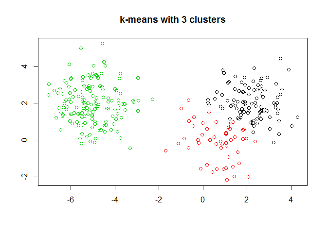<!-- -->

### How kmeans() works and practical matters

### Handling random algorithms

In the video, you saw how kmeans() randomly initializes the centers of clusters. This random initialization can result in assigning observations to different cluster labels. Also, the random initialization can result in finding different local minima for the k-means algorithm. This exercise will demonstrate both results.

At the top of each plot, the measure of model quality-total within cluster sum of squares error-will be plotted. Look for the model(s) with the lowest error to find models with the better model results.

Because kmeans() initializes observations to random clusters, it is important to set the random number generator seed for reproducibility.

Instructions    
The data, x, is still available in your workspace. Your task is to generate six kmeans() models on the data, plotting the results of each, in order to see the impact of random initializations on model results.     

    - Set the random number seed to 1 with set.seed().    
    - For each iteration of the for loop, run kmeans() on x. Assume the number of clusters is 3 and number of starts (nstart) is 1.
    - Visualize the cluster memberships using the col argument to plot(). Observe how the measure of quality and cluster assignments vary among the six model runs.


```r
# Set up 2 x 3 plotting grid
par(mfrow = c(2, 3))

# Set seed
set.seed(1)

for(i in 1:6) {
  # Run kmeans() on x with three clusters and one start
  km.out <- kmeans(x, centers=3, nstart=1)
  
  # Plot clusters
  plot(x, col = km.out$cluster, 
       main = km.out$tot.withinss, 
       xlab = "", ylab = "")
}
```

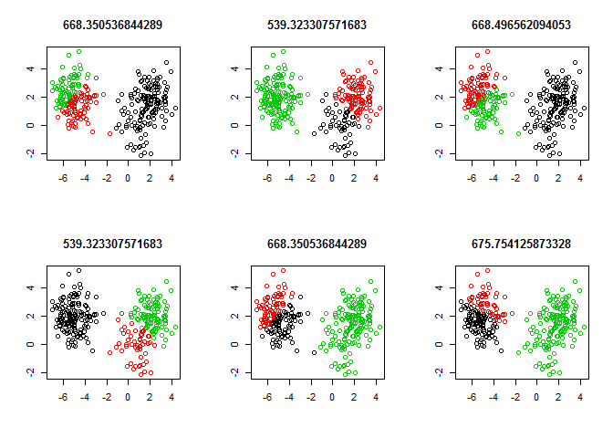<!-- -->

### Selecting number of clusters

The k-means algorithm assumes the number of clusters as part of the input. If you know the number of clusters in advance (e.g. due to certain business constraints) this makes setting the number of clusters easy. However, as you saw in the video, if you do not know the number of clusters and need to determine it, you will need to run the algorithm multiple times, each time with a different number of clusters. From this, you can observe how a measure of model quality changes with the number of clusters.   

In this exercise, you will run kmeans() multiple times to see how model quality changes as the number of clusters changes. Plots displaying this information help to determine the number of clusters and are often referred to as scree plots.    

The ideal plot will have an elbow where the quality measure improves more slowly as the number of clusters increases. This indicates that the quality of the model is no longer improving substantially as the model complexity (i.e. number of clusters) increases. In other words, the elbow indicates the number of clusters inherent in the data.    

Instructions    
The data, x, is still available in your workspace.    

    - Build 15 kmeans() models on x, each with a different number of clusters (ranging from 1 to 15). Set nstart = 20 for all model runs and save the total within cluster sum of squares for each model to the ith element of wss.
    - Run the code provided to create a scree plot of the wss for all 15 models.
    - Take a look at your scree plot. How many clusters are inherent in the data? Set k equal to the number of clusters at the location of the elbow.


```r
# Initialize total within sum of squares error: wss
wss <- 0

# For 1 to 15 cluster centers
for (i in 1:15) {
  km.out <- kmeans(x, centers = i, nstart=20)
  # Save total within sum of squares to wss variable
  wss[i] <- km.out$tot.withinss
}

# Plot total within sum of squares vs. number of clusters
plot(1:15, wss, type = "b", 
     xlab = "Number of Clusters", 
     ylab = "Within groups sum of squares")
```

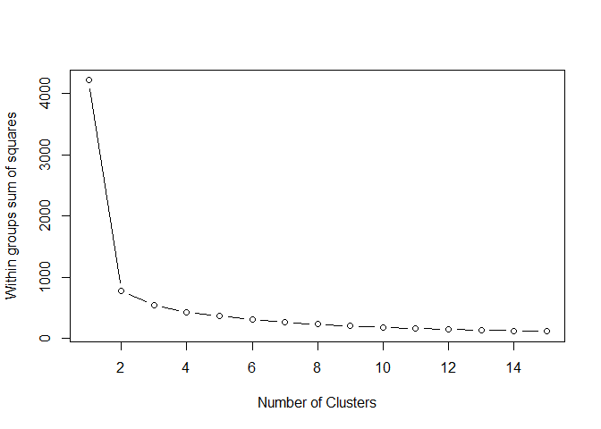<!-- -->

```r
# Set k equal to the number of clusters corresponding to the elbow location
k <- 2
```

### Introduction to the Pokemon data

### Practical matters: working with real data

Dealing with real data is often more challenging than dealing with synthetic data. Synthetic data helps with learning new concepts and techniques, but the next few exercises will deal with data that is closer to the type of real data you might find in your professional or academic pursuits.

The first challenge with the Pokemon data is that there is no pre-determined number of clusters. You will determine the appropriate number of clusters, keeping in mind that in real data the elbow in the scree plot might be less of a sharp elbow than in synthetic data. Use your judgement on making the determination of the number of clusters.

The second part of this exercise includes plotting the outcomes of the clustering on two dimensions, or features, of the data. These features were chosen somewhat arbitrarily for this exercise. Think about how you would use plotting and clustering to communicate interesting groups of Pokemon to other people.

An additional note: this exercise utilizes the iter.max argument to kmeans(). As you've seen, kmeans() is an iterative algorithm, repeating over and over until some stopping criterion is reached. The default number of iterations for kmeans() is 10, which is not enough for the algorithm to converge and reach its stopping criterion, so we'll set the number of iterations to 50 to overcome this issue. To see what happens when kmeans() does not converge, try running the example with a lower number of iterations (e.g. 3). This is another example of what might happen when you encounter real data and use real cases.

Instructions     
The pokemon dataset, which contains observations of 800 Pokemon characters on 6 dimensions (i.e. features), is available in your workspace.    

    - Using kmeans() with nstart = 20, determine the total within sum of square errors for different numbers of clusters (between 1 and 15).
    - Pick an appropriate number of clusters based on these results from the first instruction and assign that number to k.
    - Create a k-means model using k clusters and assign it to the km.out variable.
    - Create a scatter plot of Defense vs. Speed, showing cluster membership for each observation.


```r
#Load Data fetched from console and saved in pokemon.xlsx file
library(readxl)
pokemon <- read_excel("pokemon.xlsx", sheet = 1)
head(pokemon)
```

```
##   HitPoints Attack Defense SpecialAttack SpecialDefense Speed
## 1        45     49      49            65             65    45
## 2        60     62      63            80             80    60
## 3        80     82      83           100            100    80
## 4        80    100     123           122            120    80
## 5        39     52      43            60             50    65
## 6        58     64      58            80             65    80
```


```r
par(mfrow = c(1, 1))

# Initialize total within sum of squares error: wss
wss <- 0

# Look over 1 to 15 possible clusters
for (i in 1:15) {
  # Fit the model: km.out
  km.out <- kmeans(pokemon, centers = i, nstart = 20, iter.max = 50)
  # Save the within cluster sum of squares
  wss[i] <- km.out$tot.withinss
}


# Produce a scree plot
plot(1:15, wss, type = "b", 
     xlab = "Number of Clusters", 
     ylab = "Within groups sum of squares")
```

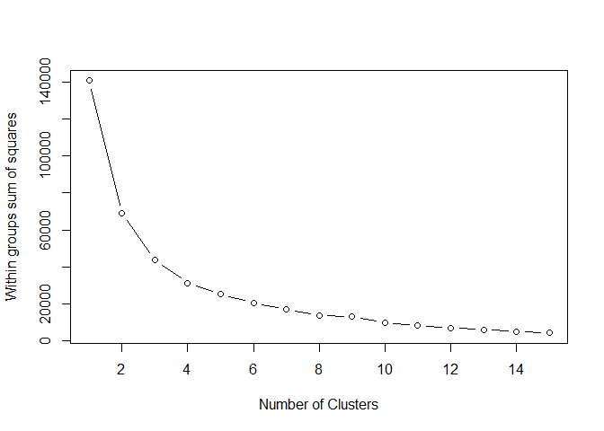<!-- -->

```r
# Select number of clusters
k <- 3

# Build model with k clusters: km.out
km.out <- kmeans(pokemon, centers = k, nstart = 50, iter.max = 50)

# View the resulting model
km.out
```

```
## K-means clustering with 3 clusters of sizes 11, 10, 8
## 
## Cluster means:
##   HitPoints   Attack  Defense SpecialAttack SpecialDefense    Speed
## 1  41.18182 43.63636 43.27273        36.000       38.54545 51.45455
## 2  63.30000 78.50000 58.60000        60.600       71.60000 85.70000
## 3  79.37500 95.75000 96.62500       121.875      100.62500 92.12500
## 
## Clustering vector:
##  [1] 1 2 3 3 1 2 3 3 3 1 2 3 3 1 1 2 1 1 2 2 1 2 2 3 1 2 1 2 1
## 
## Within cluster sum of squares by cluster:
## [1] 10719.82 21047.90 11912.88
##  (between_SS / total_SS =  68.9 %)
## 
## Available components:
## 
## [1] "cluster"      "centers"      "totss"        "withinss"    
## [5] "tot.withinss" "betweenss"    "size"         "iter"        
## [9] "ifault"
```

```r
# Plot of Defense vs. Speed by cluster membership
plot(pokemon[, c("Defense", "Speed")],
     col = km.out$cluster,
     main = paste("k-means clustering of Pokemon with", k, "clusters"),
     xlab = "Defense", ylab = "Speed")
```

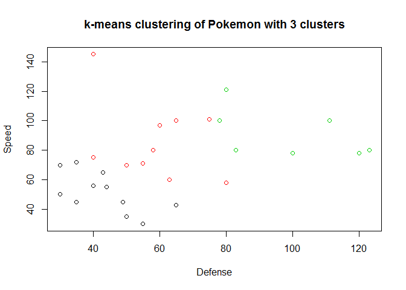<!-- -->

## 2. Hierarchical clustering 

### Hierarchical clustering with results

In this exercise, you will create your first hierarchical clustering model using the hclust() function.

We have created some data that has two dimensions and placed it in a variable called x. Your task is to create a hierarchical clustering model of x. Remember from the video that the first step to hierarchical clustering is determining the similarity between observations, which you will do with the dist() function.

You will look at the structure of the resulting model using the summary() function.

Instructions   

    - Fit a hierarchical clustering model to x using dist() to determine the similarity between observations. Store the result in hclust.out.
    - Inspect the result with the summary() function.


```r
x <- read_excel("xhclust.xlsx", sheet = 1)

# Create hierarchical clustering model: hclust.out
hclust.out <- hclust(dist(x))

# Inspect the result
summary(hclust.out)
```

```
##             Length Class  Mode     
## merge       98     -none- numeric  
## height      49     -none- numeric  
## order       50     -none- numeric  
## labels       0     -none- NULL     
## method       1     -none- character
## call         2     -none- call     
## dist.method  1     -none- character
```

### Selecting number of clusters
### Interpreting dendrogram

The plot displayed to the right shows the hclust.out model you constructed in the previous exercise. We've drawn horizontal lines at heights of 3.5, 4.5, 6.9, and 9.0, respectively.

Which cut point yields 3 clusters?

Possible Answers    

    - 3.5
    - 4.5
    - 6.9(Correct)
    - 9.0

### Cutting the tree

Remember from the video that cutree() is the R function that cuts a hierarchical model. The h and k arguments to cutree() allow you to cut the tree based on a certain height h or a certain number of clusters k.

In this exercise, you will use cutree() to cut the hierarchical model you created earlier based on each of these two criteria.

Instructions      
The hclust.out model you created earlier is available in your workspace.     

    - Cut the hclust.out model at height 7.
    - Cut the hclust.out model to create 3 clusters.


```r
# Cut by height
cutree(hclust.out, h=7)
```

```
##  [1] 1 1 1 1 1 1 1 1 2 1 1 1 1 1 1 1 1 1 1 1 1 1 1 1 1 3 3 3 3 3 3 3 3 3 3
## [36] 2 2 2 2 2 2 2 2 2 2 2 2 2 2 2
```

```r
# Cut by number of clusters
cutree(hclust.out, k=3)
```

```
##  [1] 1 1 1 1 1 1 1 1 2 1 1 1 1 1 1 1 1 1 1 1 1 1 1 1 1 3 3 3 3 3 3 3 3 3 3
## [36] 2 2 2 2 2 2 2 2 2 2 2 2 2 2 2
```

### Clustering linkage and practical matters

### Linkage methods

In this exercise, you will produce hierarchical clustering models using different linkages and plot the dendrogram for each, observing the overall structure of the trees.

You'll be asked to interpret the results in the next exercise.

Instructions    

    - Produce three hierarchical clustering models on x using the "complete", "average", and "single" linkage methods, respectively.
    - Plot a dendrogram for each model, using titles of "Complete", "Average", and "Single", respectively.


```r
# Cluster using complete linkage: hclust.complete
hclust.complete <- hclust(dist(x), method="complete")

# Cluster using average linkage: hclust.average
hclust.average <- hclust(dist(x), method="average")

# Cluster using single linkage: hclust.single
hclust.single <- hclust(dist(x), method="single")

# Plot dendrogram of hclust.complete
plot(hclust.complete, main="Complete")
```

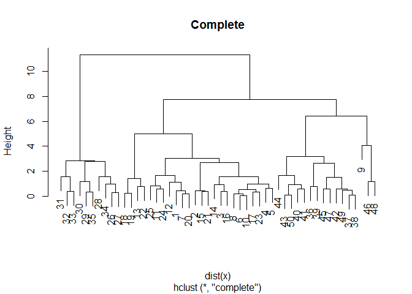<!-- -->

```r
# Plot dendrogram of hclust.average
plot(hclust.average, main="Average")
```

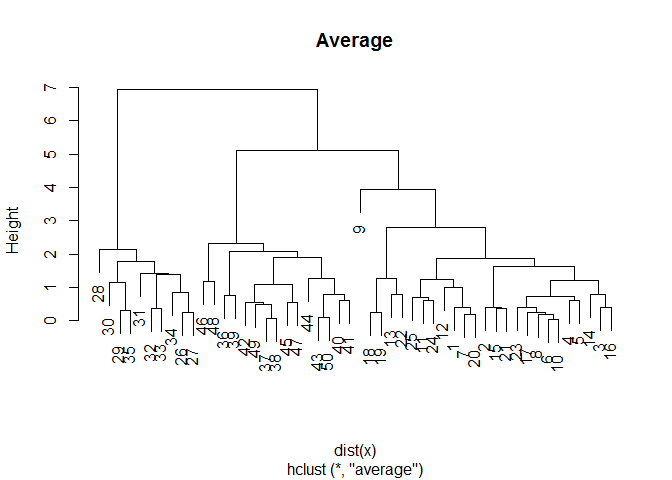<!-- -->

```r
# Plot dendrogram of hclust.single
plot(hclust.single, main="Single")
```

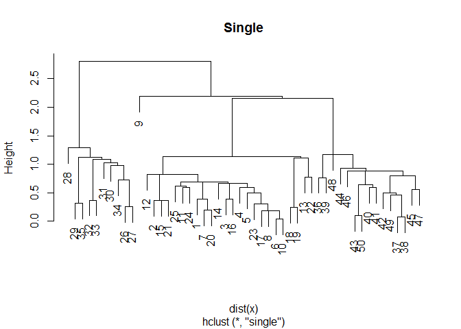<!-- -->

### Comparing linkage methods

The models you created in the last exercise-hclust.complete, hclust.average, and hclust.single-are available in your workspace.

Which linkage(s) produce balanced trees?

Possible Answers

    - Complete only
    - Average only
    - Single only
    - Average and single
    - Complete and average (Correct)
    - All three

### Practical matters: scaling

Recall from the video that clustering real data may require scaling the features if they have different distributions. So far in this chapter, you have been working with synthetic data that did not need scaling.

In this exercise, you will go back to working with "real" data, the pokemon dataset introduced in the first chapter. You will observe the distribution (mean and standard deviation) of each feature, scale the data accordingly, then produce a hierarchical clustering model using the complete linkage method.

Instructions    
The data is stored in the pokemon object in your workspace.   

    - Observe the mean of each variable in pokemon using the colMeans() function.
    - Observe the standard deviation of each variable using the apply() and sd() functions. Since the variables are the columns of your matrix, make sure to specify 2 as the MARGIN argument to apply().
    - Scale the pokemon data using the scale() function and store the result in pokemon.scaled.
    - Create a hierarchical clustering model of the pokemon.scaled data using the complete linkage method. Store the result in hclust.pokemon.


```r
#Load the data fetched from the console as pokemonhclust.xlsx
library(readxl)
pokemon <- read_excel("pokemonhclust.xlsx", sheet = 1)
```

    

```r
# View column means
colMeans(pokemon)
```

```
##      HitPoints         Attack        Defense  SpecialAttack SpecialDefense 
##       69.25875       79.00125       73.84250       72.82000       71.90250 
##          Speed 
##       68.27750
```

```r
# View column standard deviations
apply(pokemon, 2, sd)
```

```
##      HitPoints         Attack        Defense  SpecialAttack SpecialDefense 
##       25.53467       32.45737       31.18350       32.72229       27.82892 
##          Speed 
##       29.06047
```

```r
# Scale the data
pokemon.scaled <- scale(pokemon)

# Create hierarchical clustering model: hclust.pokemon
hclust.pokemon <- hclust(dist(pokemon.scaled), method="complete")
```

### Comparing kmeans() and hclust()

Comparing k-means and hierarchical clustering, you'll see the two methods produce different cluster memberships. This is because the two algorithms make different assumptions about how the data is generated. In a more advanced course, we could choose to use one model over another based on the quality of the models' assumptions, but for now, it's enough to observe that they are different.

This exercise will have you compare results from the two models on the pokemon dataset to see how they differ.

Instructions     
The results from running k-means clustering on the pokemon data (for 3 clusters) are stored as km.pokemon. The hierarchical clustering model you created in the previous exercise is still available as hclust.pokemon.    

    - Using cutree() on hclust.pokemon, assign cluster membership to each observation. Assume three clusters and assign the result to a vector called cut.pokemon.
    - Using table(), compare cluster membership between the two clustering methods. Recall that the different components of k-means model objects can be accessed with the $ operator.


```r
km.pokemon <- kmeans(pokemon, centers=3, nstart = 20)
```


```r
# Apply cutree() to hclust.pokemon: cut.pokemon
cut.pokemon <- cutree(hclust.pokemon, k=3)

# Compare methods
table(km.pokemon$cluster, cut.pokemon)
```

```
##    cut.pokemon
##       1   2   3
##   1 350   5   0
##   2 267   3   0
##   3 171   3   1
```


## 3. Dimensionality reduction with PCA 

Overall steps   
- Download data and prepare data for modeling
- Exploratory data analysis (# observations, # features, etc.)
- Perform PCA and interpret results
- Complete two types of clustering
- Understand and compare the two types
- Combine PCA and clustering

### Preparing the data

Unlike prior chapters, where we prepared the data for you for unsupervised learning, the goal of this chapter is to step you through a more realistic and complete workflow.

Recall from the video that the first step is to download and prepare the data.

Instructions :    

    - Use read.csv() function to download the CSV (comma-separated values) file containing the data from the - URL provided. Assign the result to wisc.df.
    - Use as.matrix() to convert the features of the data (in columns 3 through 32) to a matrix. Store this in a variable called wisc.data.
    - Assign the row names of wisc.data the values currently contained in the id column of wisc.df. While not strictly required, this will help you keep track of the different observations throughout the modeling process.
    - Finally, set a vector called diagnosis to be 1 if a diagnosis is malignant ("M") and 0 otherwise. Note that R coerces TRUE to 1 and FALSE to 0.


```r
url <- "http://s3.amazonaws.com/assets.datacamp.com/production/course_1903/datasets/WisconsinCancer.csv"

# Download the data: wisc.df
wisc.df <- read.csv(url)

# Convert the features of the data: wisc.data
wisc.data <- as.matrix(wisc.df[3:32])

# Set the row names of wisc.data
row.names(wisc.data) <- wisc.df$id

# Create diagnosis vector
diagnosis <- as.numeric(wisc.df$diagnosis == "M")
```

### Exploratory data analysis

The first step of any data analysis, unsupervised or supervised, is to familiarize yourself with the data.

The variables you created before, wisc.data and diagnosis, are still available in your workspace. Explore the data to answer the following questions:

How many observations are in this dataset?
How many variables/features in the data are suffixed with _mean?
How many of the observations have a malignant diagnosis?
Possible Answers    

    - 569, 5, 112
    - 30, 10, 212
    - 569, 10, 212 (Correct)
    - 30, 5, 112


```r
dim(wisc.data)
```

```
## [1] 569  30
```

```r
colnames(wisc.data)
```

```
##  [1] "radius_mean"             "texture_mean"           
##  [3] "perimeter_mean"          "area_mean"              
##  [5] "smoothness_mean"         "compactness_mean"       
##  [7] "concavity_mean"          "concave.points_mean"    
##  [9] "symmetry_mean"           "fractal_dimension_mean" 
## [11] "radius_se"               "texture_se"             
## [13] "perimeter_se"            "area_se"                
## [15] "smoothness_se"           "compactness_se"         
## [17] "concavity_se"            "concave.points_se"      
## [19] "symmetry_se"             "fractal_dimension_se"   
## [21] "radius_worst"            "texture_worst"          
## [23] "perimeter_worst"         "area_worst"             
## [25] "smoothness_worst"        "compactness_worst"      
## [27] "concavity_worst"         "concave.points_worst"   
## [29] "symmetry_worst"          "fractal_dimension_worst"
```

```r
length(grep("_mean", colnames(wisc.data)))
```

```
## [1] 10
```

```r
colnames(wisc.data)[(grep("_mean", colnames(wisc.data)))]
```

```
##  [1] "radius_mean"            "texture_mean"          
##  [3] "perimeter_mean"         "area_mean"             
##  [5] "smoothness_mean"        "compactness_mean"      
##  [7] "concavity_mean"         "concave.points_mean"   
##  [9] "symmetry_mean"          "fractal_dimension_mean"
```

```r
table(diagnosis)
```

```
## diagnosis
##   0   1 
## 357 212
```

### Performing PCA

The next step in your analysis is to perform PCA on wisc.data.

You saw in the last chapter that it's important to check if the data need to be scaled before performing PCA. Recall two common reasons for scaling data:

    - The input variables use different units of measurement.
    - The input variables have significantly different variances.
    
Instructions    

    - The variables you created before, wisc.data and diagnosis, are still available in your workspace.
    - Check the mean and standard deviation of the features of the data to determine if the data should be scaled. Use the colMeans() and apply() functions like you've done before.
    - Execute PCA on the wisc.data, scaling if appropriate, and assign the model to wisc.pr.
    - Inspect a summary of the results with the summary() function.


```r
# Check column means and standard deviations
colMeans(wisc.data)
```

```
##             radius_mean            texture_mean          perimeter_mean 
##            1.412729e+01            1.928965e+01            9.196903e+01 
##               area_mean         smoothness_mean        compactness_mean 
##            6.548891e+02            9.636028e-02            1.043410e-01 
##          concavity_mean     concave.points_mean           symmetry_mean 
##            8.879932e-02            4.891915e-02            1.811619e-01 
##  fractal_dimension_mean               radius_se              texture_se 
##            6.279761e-02            4.051721e-01            1.216853e+00 
##            perimeter_se                 area_se           smoothness_se 
##            2.866059e+00            4.033708e+01            7.040979e-03 
##          compactness_se            concavity_se       concave.points_se 
##            2.547814e-02            3.189372e-02            1.179614e-02 
##             symmetry_se    fractal_dimension_se            radius_worst 
##            2.054230e-02            3.794904e-03            1.626919e+01 
##           texture_worst         perimeter_worst              area_worst 
##            2.567722e+01            1.072612e+02            8.805831e+02 
##        smoothness_worst       compactness_worst         concavity_worst 
##            1.323686e-01            2.542650e-01            2.721885e-01 
##    concave.points_worst          symmetry_worst fractal_dimension_worst 
##            1.146062e-01            2.900756e-01            8.394582e-02
```

```r
apply(wisc.data, 2, sd)
```

```
##             radius_mean            texture_mean          perimeter_mean 
##            3.524049e+00            4.301036e+00            2.429898e+01 
##               area_mean         smoothness_mean        compactness_mean 
##            3.519141e+02            1.406413e-02            5.281276e-02 
##          concavity_mean     concave.points_mean           symmetry_mean 
##            7.971981e-02            3.880284e-02            2.741428e-02 
##  fractal_dimension_mean               radius_se              texture_se 
##            7.060363e-03            2.773127e-01            5.516484e-01 
##            perimeter_se                 area_se           smoothness_se 
##            2.021855e+00            4.549101e+01            3.002518e-03 
##          compactness_se            concavity_se       concave.points_se 
##            1.790818e-02            3.018606e-02            6.170285e-03 
##             symmetry_se    fractal_dimension_se            radius_worst 
##            8.266372e-03            2.646071e-03            4.833242e+00 
##           texture_worst         perimeter_worst              area_worst 
##            6.146258e+00            3.360254e+01            5.693570e+02 
##        smoothness_worst       compactness_worst         concavity_worst 
##            2.283243e-02            1.573365e-01            2.086243e-01 
##    concave.points_worst          symmetry_worst fractal_dimension_worst 
##            6.573234e-02            6.186747e-02            1.806127e-02
```

```r
# Execute PCA, scaling if appropriate: wisc.pr
wisc.pr <- prcomp(wisc.data, scale=TRUE)

# Look at summary of results
summary(wisc.pr)
```

```
## Importance of components:
##                           PC1    PC2     PC3     PC4     PC5     PC6
## Standard deviation     3.6444 2.3857 1.67867 1.40735 1.28403 1.09880
## Proportion of Variance 0.4427 0.1897 0.09393 0.06602 0.05496 0.04025
## Cumulative Proportion  0.4427 0.6324 0.72636 0.79239 0.84734 0.88759
##                            PC7     PC8    PC9    PC10   PC11    PC12
## Standard deviation     0.82172 0.69037 0.6457 0.59219 0.5421 0.51104
## Proportion of Variance 0.02251 0.01589 0.0139 0.01169 0.0098 0.00871
## Cumulative Proportion  0.91010 0.92598 0.9399 0.95157 0.9614 0.97007
##                           PC13    PC14    PC15    PC16    PC17    PC18
## Standard deviation     0.49128 0.39624 0.30681 0.28260 0.24372 0.22939
## Proportion of Variance 0.00805 0.00523 0.00314 0.00266 0.00198 0.00175
## Cumulative Proportion  0.97812 0.98335 0.98649 0.98915 0.99113 0.99288
##                           PC19    PC20   PC21    PC22    PC23   PC24
## Standard deviation     0.22244 0.17652 0.1731 0.16565 0.15602 0.1344
## Proportion of Variance 0.00165 0.00104 0.0010 0.00091 0.00081 0.0006
## Cumulative Proportion  0.99453 0.99557 0.9966 0.99749 0.99830 0.9989
##                           PC25    PC26    PC27    PC28    PC29    PC30
## Standard deviation     0.12442 0.09043 0.08307 0.03987 0.02736 0.01153
## Proportion of Variance 0.00052 0.00027 0.00023 0.00005 0.00002 0.00000
## Cumulative Proportion  0.99942 0.99969 0.99992 0.99997 1.00000 1.00000
```

### Interpreting PCA results

Now you'll use some visualizations to better understand your PCA model. You were introduced to one of these visualizations, the biplot, in an earlier chapter.

You'll run into some common challenges with using biplots on real-world data containing a non-trivial number of observations and variables, then you'll look at some alternative visualizations. You are encouraged to experiment with additional visualizations before moving on to the next exercise.

Instructions    
The variables you created before, wisc.data, diagnosis, and wisc.pr, are still available.

    - Create a biplot of the wisc.pr data. What stands out to you about this plot? Is it easy or difficult to understand? Why?
    - Execute the code to scatter plot each observation by principal components 1 and 2, coloring the points by the diagnosis.
    - Repeat the same for principal components 1 and 3. What do you notice about these plots?


```r
# Create a biplot of wisc.pr
biplot(wisc.pr)
```

<!-- -->

```r
# Scatter plot observations by components 1 and 2
plot(wisc.pr$x[, c(1, 2)], col = (diagnosis + 1), 
     xlab = "PC1", ylab = "PC2")
```

<!-- -->

```r
# Repeat for components 1 and 3
plot(wisc.pr$x[, c(1, 3)], col = (diagnosis + 1), 
     xlab = "PC1", ylab = "PC3")
```

<!-- -->

```r
# Do additional data exploration of your choosing below (optional)
plot(wisc.pr$x[, c(1, 4)], col = (diagnosis + 1), 
     xlab = "PC1", ylab = "PC3")
```

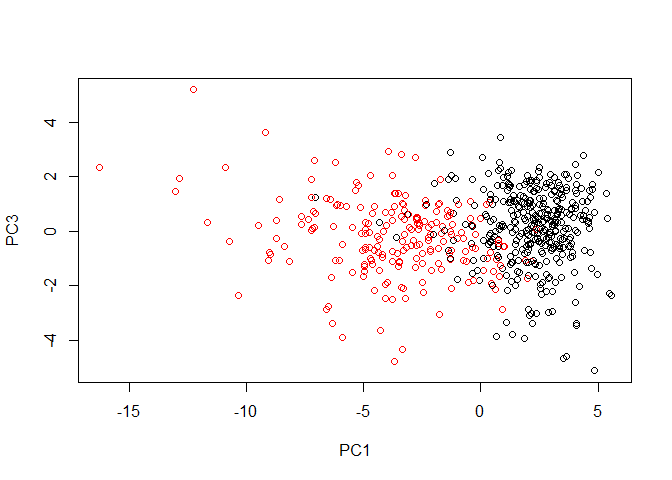<!-- -->

Because principal component 2 explains more variance in the original data than principal component 3, you can see that the first plot has a cleaner cut separating the two subgroups.

    
Variance explained
100xp
In this exercise, you will produce scree plots showing the proportion of variance explained as the number of principal components increases. The data from PCA must be prepared for these plots, as there is not a built-in function in R to create them directly from the PCA model.

As you look at these plots, ask yourself if there's an elbow in the amount of variance explained that might lead you to pick a natural number of principal components. If an obvious elbow does not exist, as is typical in real-world datasets, consider how else you might determine the number of principal components to retain based on the scree plot.

Instructions
The variables you created before, wisc.data, diagnosis, and wisc.pr, are still available.

    - Calculate the variance of each principal component by squaring the sdev components of wisc.pr. Save the result as an object called pr.var.
    - Calculate the variance explained by each principal component by dividing by the total variance explained of all principal components. Assign this to a variable called pve.
    - Create a plot of variance explained for each principal component.
    - Using the cumsum() function, create a plot of cumulative proportion of variance explained.
    

```r
par(mfrow = c(1, 2))

# Calculate variability of each component
pr.var <- wisc.pr$sdev^2

# Variance explained by each principal component: pve
pve <- pr.var/sum(pr.var)

# Plot variance explained for each principal component
plot(pve, xlab = "Principal Component", 
     ylab = "Proportion of Variance Explained", 
     ylim = c(0, 1), type = "b")

# Plot cumulative proportion of variance explained
plot(cumsum(pve), xlab = "Principal Component", 
     ylab = "Cummulative Proportion of Variance Explained", 
     ylim = c(0, 1), type = "b")
```

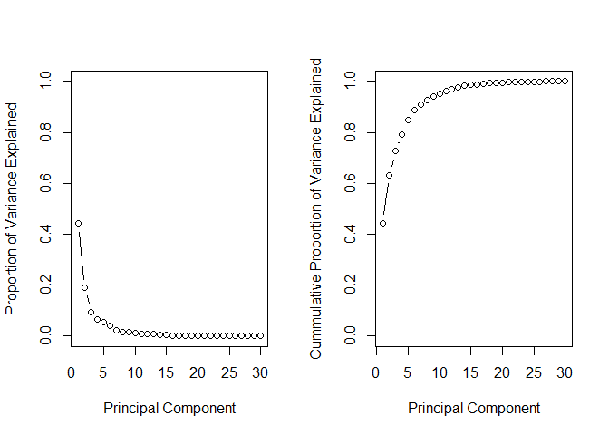<!-- -->

Before moving on, answer the following question: What is the minimum number of principal components needed to explain 80% of the variance in the data? Write it down as you may need this in the next exercise :)

4 Principal Components

### Communicating PCA results

This exercise will check your understanding of the PCA results, in particular the loadings and variance explained. The loadings, represented as vectors, explain the mapping from the original features to the principal components. The principal components are naturally ordered from the most variance explained to the least variance explained.

The variables you created before-wisc.data, diagnosis, wisc.pr, and pve-are still available.

For the first principal component, what is the component of the loading vector for the feature concave.points_mean? What is the minimum number of principal components required to explain 80% of the variance of the data?

Possible Answers

    -0.26085376, 5
    -0.25088597, 2
    -0.034767500, 4
    -0.26085376, 5
    

```r
wisc.pr$rotation[rownames(wisc.pr$rotation)=="concave.points_mean",]
```

```
##          PC1          PC2          PC3          PC4          PC5 
## -0.260853758  0.034767500 -0.025563541  0.065335944  0.043861025 
##          PC6          PC7          PC8          PC9         PC10 
## -0.052049950 -0.150482214  0.152322414 -0.111971106  0.008054528 
##         PC11         PC12         PC13         PC14         PC15 
##  0.072446026  0.042589267  0.132138097 -0.244794768 -0.217099194 
##         PC16         PC17         PC18         PC19         PC20 
##  0.380464095  0.034509509 -0.082827737 -0.154972363 -0.235407606 
##         PC21         PC22         PC23         PC24         PC25 
## -0.009423819  0.311852431 -0.051408797  0.084027697 -0.186451602 
##         PC26         PC27         PC28         PC29         PC30 
##  0.387643377 -0.454699351 -0.008883097 -0.004206949 -0.001077265
```

```r
wisc.pr$rotation[rownames(wisc.pr$rotation)=="concave.points_mean",][1]
```

```
##        PC1 
## -0.2608538
```

## 4. Putting it all together with a case study 

### PCA review and next steps
Hierarchical clustering of case data

The goal of this exercise is to do hierarchical clustering of the observations. Recall from Chapter 2 that this type of clustering does not assume in advance the number of natural groups that exist in the data.

As part of the preparation for hierarchical clustering, distance between all pairs of observations are computed. Furthermore, there are different ways to link clusters together, with single, complete, and average being the most common linkage methods.

Instructions
The variables you created before, wisc.data, diagnosis, wisc.pr, and pve, are available in your workspace.

    - Scale the wisc.data data and assign the result to data.scaled.
    - Calculate the (Euclidean) distances between all pairs of observations in the new scaled dataset and assign the result to data.dist.
    - Create a hierarchical clustering model using complete linkage. Manually specify the method argument to hclust() and assign the results to wisc.hclust.
    

```r
round(colMeans(wisc.data),1)
```

```
##             radius_mean            texture_mean          perimeter_mean 
##                    14.1                    19.3                    92.0 
##               area_mean         smoothness_mean        compactness_mean 
##                   654.9                     0.1                     0.1 
##          concavity_mean     concave.points_mean           symmetry_mean 
##                     0.1                     0.0                     0.2 
##  fractal_dimension_mean               radius_se              texture_se 
##                     0.1                     0.4                     1.2 
##            perimeter_se                 area_se           smoothness_se 
##                     2.9                    40.3                     0.0 
##          compactness_se            concavity_se       concave.points_se 
##                     0.0                     0.0                     0.0 
##             symmetry_se    fractal_dimension_se            radius_worst 
##                     0.0                     0.0                    16.3 
##           texture_worst         perimeter_worst              area_worst 
##                    25.7                   107.3                   880.6 
##        smoothness_worst       compactness_worst         concavity_worst 
##                     0.1                     0.3                     0.3 
##    concave.points_worst          symmetry_worst fractal_dimension_worst 
##                     0.1                     0.3                     0.1
```

```r
round(apply(wisc.data,2,sd),1)
```

```
##             radius_mean            texture_mean          perimeter_mean 
##                     3.5                     4.3                    24.3 
##               area_mean         smoothness_mean        compactness_mean 
##                   351.9                     0.0                     0.1 
##          concavity_mean     concave.points_mean           symmetry_mean 
##                     0.1                     0.0                     0.0 
##  fractal_dimension_mean               radius_se              texture_se 
##                     0.0                     0.3                     0.6 
##            perimeter_se                 area_se           smoothness_se 
##                     2.0                    45.5                     0.0 
##          compactness_se            concavity_se       concave.points_se 
##                     0.0                     0.0                     0.0 
##             symmetry_se    fractal_dimension_se            radius_worst 
##                     0.0                     0.0                     4.8 
##           texture_worst         perimeter_worst              area_worst 
##                     6.1                    33.6                   569.4 
##        smoothness_worst       compactness_worst         concavity_worst 
##                     0.0                     0.2                     0.2 
##    concave.points_worst          symmetry_worst fractal_dimension_worst 
##                     0.1                     0.1                     0.0
```


```r
# Scale the wisc.data data: data.scaled
data.scaled <- scale(wisc.data)

# Calculate the (Euclidean) distances: data.dist
data.dist <- dist(data.scaled)

# Create a hierarchical clustering model: wisc.hclust
wisc.hclust <- hclust(data.dist, method="complete")
```


```r
round(colMeans(data.scaled),1)
```

```
##             radius_mean            texture_mean          perimeter_mean 
##                       0                       0                       0 
##               area_mean         smoothness_mean        compactness_mean 
##                       0                       0                       0 
##          concavity_mean     concave.points_mean           symmetry_mean 
##                       0                       0                       0 
##  fractal_dimension_mean               radius_se              texture_se 
##                       0                       0                       0 
##            perimeter_se                 area_se           smoothness_se 
##                       0                       0                       0 
##          compactness_se            concavity_se       concave.points_se 
##                       0                       0                       0 
##             symmetry_se    fractal_dimension_se            radius_worst 
##                       0                       0                       0 
##           texture_worst         perimeter_worst              area_worst 
##                       0                       0                       0 
##        smoothness_worst       compactness_worst         concavity_worst 
##                       0                       0                       0 
##    concave.points_worst          symmetry_worst fractal_dimension_worst 
##                       0                       0                       0
```

```r
round(apply(data.scaled,2,sd),1)
```

```
##             radius_mean            texture_mean          perimeter_mean 
##                       1                       1                       1 
##               area_mean         smoothness_mean        compactness_mean 
##                       1                       1                       1 
##          concavity_mean     concave.points_mean           symmetry_mean 
##                       1                       1                       1 
##  fractal_dimension_mean               radius_se              texture_se 
##                       1                       1                       1 
##            perimeter_se                 area_se           smoothness_se 
##                       1                       1                       1 
##          compactness_se            concavity_se       concave.points_se 
##                       1                       1                       1 
##             symmetry_se    fractal_dimension_se            radius_worst 
##                       1                       1                       1 
##           texture_worst         perimeter_worst              area_worst 
##                       1                       1                       1 
##        smoothness_worst       compactness_worst         concavity_worst 
##                       1                       1                       1 
##    concave.points_worst          symmetry_worst fractal_dimension_worst 
##                       1                       1                       1
```

```r
## After scaling mean is 0 and standard deviation is 1
```

### Results of hierarchical clustering

Let's use the hierarchical clustering model you just created to determine a height (or distance between clusters) where a certain number of clusters exists. The variables you created before-wisc.data, diagnosis, wisc.pr, pve, and wisc.hclust-are all available in your workspace.

Using the plot() function, what is the height at which the clustering model has 4 clusters?

Possible Answers

    - 20 (Correct)
    - 4
    - 10
    - 24
    

```r
plot(wisc.hclust)
```

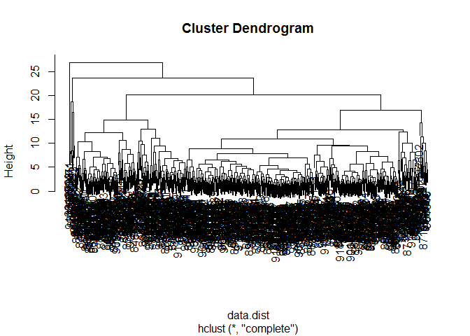<!-- -->

### Selecting number of clusters

In this exercise, you will compare the outputs from your hierarchical clustering model to the actual diagnoses. Normally when performing unsupervised learning like this, a target variable isn't available. We do have it with this dataset, however, so it can be used to check the performance of the clustering model.

When performing supervised learning-that is, when you're trying to predict some target variable of interest and that target variable is available in the original data-using clustering to create new features may or may not improve the performance of the final model. This exercise will help you determine if, in this case, hierarchical clustering provides a promising new feature.

Instructions
wisc.data, diagnosis, wisc.pr, pve, and wisc.hclust are available in your workspace.

    - Use cutree() to cut the tree so that it has 4 clusters. Assign the output to the variable wisc.hclust.clusters.
    - Use the table() function to compare the cluster membership to the actual diagnoses.
    

```r
# Cut tree so that it has 4 clusters: wisc.hclust.clusters
wisc.hclust.clusters <- cutree(wisc.hclust, k=4)

# Compare cluster membership to actual diagnoses
table(wisc.hclust.clusters, diagnosis)
```

```
##                     diagnosis
## wisc.hclust.clusters   0   1
##                    1  12 165
##                    2   2   5
##                    3 343  40
##                    4   0   2
```
Four clusters were picked after some exploration. Before moving on, you may want to explore how different numbers of clusters affect the ability of the hierarchical clustering to separate the different diagnoses. Great job!

### k-means clustering and comparing results

As you now know, there are two main types of clustering: hierarchical and k-means.

In this exercise, you will create a k-means clustering model on the Wisconsin breast cancer data and compare the results to the actual diagnoses and the results of your hierarchical clustering model. Take some time to see how each clustering model performs in terms of separating the two diagnoses and how the clustering models compare to each other.

Instructions
wisc.data, diagnosis, and wisc.hclust.clusters are still available.

    - Create a k-means model on wisc.data, assigning the result to wisc.km. Be sure to create 2 clusters, corresponding to the actual number of diagnosis. Also, remember to scale the data appropriately and repeat the algorithm 20 times to find a well performing model.
    - Use the table() function to compare the cluster membership of the k-means model to the actual diagnoses contained in the diagnosis vector. How well does k-means separate the two diagnoses?
    - Use the table() function to compare the cluster membership of the k-means model to the hierarchical clustering model. Recall the cluster membership of the hierarchical clustering model is contained in wisc.hclust.clusters.


```r
# Create a k-means model on wisc.data: wisc.km
wisc.km <- kmeans(scale(wisc.data), centers=2, nstart=20)

# Compare k-means to actual diagnoses
table(wisc.km$cluster, diagnosis)
```

```
##    diagnosis
##       0   1
##   1 343  37
##   2  14 175
```

```r
# Compare k-means to hierarchical clustering
table(wisc.km$cluster, wisc.hclust.clusters)
```

```
##    wisc.hclust.clusters
##       1   2   3   4
##   1  17   0 363   0
##   2 160   7  20   2
```

Looking at the second table you generated, it looks like clusters 1, 2, and 4 from the hierarchical clustering model can be interpreted as the cluster 1 equivalent from the k-means algorithm, and cluster 3 can be interpreted as the cluster 2 equivalent.


### Clustering on PCA results

In this final exercise, you will put together several steps you used earlier and, in doing so, you will experience some of the creativity that is typical in unsupervised learning.

Recall from earlier exercises that the PCA model required significantly fewer features to describe 80% and 95% of the variability of the data. In addition to normalizing data and potentially avoiding overfitting, PCA also uncorrelates the variables, sometimes improving the performance of other modeling techniques.

Let's see if PCA improves or degrades the performance of hierarchical clustering.

Instructions
wisc.pr, diagnosis, wisc.hclust.clusters, and wisc.km are still available in your workspace.

    - Using the minimum number of principal components required to describe at least 90% of the variability in the data, create a hierarchical clustering model with complete linkage. Assign the results to wisc.pr.hclust.
    - Cut this hierarchical clustering model into 4 clusters and assign the results to wisc.pr.hclust.clusters.
    - Using table(), compare the results from your new hierarchical clustering model with the actual diagnoses. How well does the newly created model with four clusters separate out the two diagnoses?
    - How well do the k-means and hierarchical clustering models you created in previous exercises do in terms of separating the diagnoses? Again, use the table() function to compare the output of each model with the vector containing the actual diagnoses.
    

```r
### Calculating the variance
par(mfrow = c(1, 2))

# Calculate variability of each component
pr.var <- wisc.pr$sdev^2

# Variance explained by each principal component: pve
pve <- pr.var/sum(pr.var)

# Plot variance explained for each principal component
plot(pve, xlab = "Principal Component", 
     ylab = "Proportion of Variance Explained", 
     ylim = c(0, 1), type = "b")

# Plot cumulative proportion of variance explained
plot(cumsum(pve), xlab = "Principal Component", 
     ylab = "Cummulative Proportion of Variance Explained", 
     ylim = c(0, 1), type = "b")
```

<!-- -->


```r
#Finding the cumulative variance
for(i in 1:length(pve)){
  print(paste("Num of Components", i, "Variance", cumsum(pve[1:i])))
}
```

```
## [1] "Num of Components 1 Variance 0.442720256075263"
## [1] "Num of Components 2 Variance 0.442720256075263"
## [2] "Num of Components 2 Variance 0.632432076515594"
## [1] "Num of Components 3 Variance 0.442720256075263"
## [2] "Num of Components 3 Variance 0.632432076515594"
## [3] "Num of Components 3 Variance 0.726363709089908"
## [1] "Num of Components 4 Variance 0.442720256075263"
## [2] "Num of Components 4 Variance 0.632432076515594"
## [3] "Num of Components 4 Variance 0.726363709089908"
## [4] "Num of Components 4 Variance 0.79238505824461" 
## [1] "Num of Components 5 Variance 0.442720256075263"
## [2] "Num of Components 5 Variance 0.632432076515594"
## [3] "Num of Components 5 Variance 0.726363709089908"
## [4] "Num of Components 5 Variance 0.79238505824461" 
## [5] "Num of Components 5 Variance 0.847342743168072"
## [1] "Num of Components 6 Variance 0.442720256075263"
## [2] "Num of Components 6 Variance 0.632432076515594"
## [3] "Num of Components 6 Variance 0.726363709089908"
## [4] "Num of Components 6 Variance 0.79238505824461" 
## [5] "Num of Components 6 Variance 0.847342743168072"
## [6] "Num of Components 6 Variance 0.887587963566906"
## [1] "Num of Components 7 Variance 0.442720256075263"
## [2] "Num of Components 7 Variance 0.632432076515594"
## [3] "Num of Components 7 Variance 0.726363709089908"
## [4] "Num of Components 7 Variance 0.79238505824461" 
## [5] "Num of Components 7 Variance 0.847342743168072"
## [6] "Num of Components 7 Variance 0.887587963566906"
## [7] "Num of Components 7 Variance 0.910095300696731"
## [1] "Num of Components 8 Variance 0.442720256075263"
## [2] "Num of Components 8 Variance 0.632432076515594"
## [3] "Num of Components 8 Variance 0.726363709089908"
## [4] "Num of Components 8 Variance 0.79238505824461" 
## [5] "Num of Components 8 Variance 0.847342743168072"
## [6] "Num of Components 8 Variance 0.887587963566906"
## [7] "Num of Components 8 Variance 0.910095300696731"
## [8] "Num of Components 8 Variance 0.925982538696944"
## [1] "Num of Components 9 Variance 0.442720256075263"
## [2] "Num of Components 9 Variance 0.632432076515594"
## [3] "Num of Components 9 Variance 0.726363709089908"
## [4] "Num of Components 9 Variance 0.79238505824461" 
## [5] "Num of Components 9 Variance 0.847342743168072"
## [6] "Num of Components 9 Variance 0.887587963566906"
## [7] "Num of Components 9 Variance 0.910095300696731"
## [8] "Num of Components 9 Variance 0.925982538696944"
## [9] "Num of Components 9 Variance 0.939879032442535"
##  [1] "Num of Components 10 Variance 0.442720256075263"
##  [2] "Num of Components 10 Variance 0.632432076515594"
##  [3] "Num of Components 10 Variance 0.726363709089908"
##  [4] "Num of Components 10 Variance 0.79238505824461" 
##  [5] "Num of Components 10 Variance 0.847342743168072"
##  [6] "Num of Components 10 Variance 0.887587963566906"
##  [7] "Num of Components 10 Variance 0.910095300696731"
##  [8] "Num of Components 10 Variance 0.925982538696944"
##  [9] "Num of Components 10 Variance 0.939879032442535"
## [10] "Num of Components 10 Variance 0.951568814336667"
##  [1] "Num of Components 11 Variance 0.442720256075263"
##  [2] "Num of Components 11 Variance 0.632432076515594"
##  [3] "Num of Components 11 Variance 0.726363709089908"
##  [4] "Num of Components 11 Variance 0.79238505824461" 
##  [5] "Num of Components 11 Variance 0.847342743168072"
##  [6] "Num of Components 11 Variance 0.887587963566906"
##  [7] "Num of Components 11 Variance 0.910095300696731"
##  [8] "Num of Components 11 Variance 0.925982538696944"
##  [9] "Num of Components 11 Variance 0.939879032442535"
## [10] "Num of Components 11 Variance 0.951568814336667"
## [11] "Num of Components 11 Variance 0.961366004212647"
##  [1] "Num of Components 12 Variance 0.442720256075263"
##  [2] "Num of Components 12 Variance 0.632432076515594"
##  [3] "Num of Components 12 Variance 0.726363709089908"
##  [4] "Num of Components 12 Variance 0.79238505824461" 
##  [5] "Num of Components 12 Variance 0.847342743168072"
##  [6] "Num of Components 12 Variance 0.887587963566906"
##  [7] "Num of Components 12 Variance 0.910095300696731"
##  [8] "Num of Components 12 Variance 0.925982538696944"
##  [9] "Num of Components 12 Variance 0.939879032442535"
## [10] "Num of Components 12 Variance 0.951568814336667"
## [11] "Num of Components 12 Variance 0.961366004212647"
## [12] "Num of Components 12 Variance 0.970071383220026"
##  [1] "Num of Components 13 Variance 0.442720256075263"
##  [2] "Num of Components 13 Variance 0.632432076515594"
##  [3] "Num of Components 13 Variance 0.726363709089908"
##  [4] "Num of Components 13 Variance 0.79238505824461" 
##  [5] "Num of Components 13 Variance 0.847342743168072"
##  [6] "Num of Components 13 Variance 0.887587963566906"
##  [7] "Num of Components 13 Variance 0.910095300696731"
##  [8] "Num of Components 13 Variance 0.925982538696944"
##  [9] "Num of Components 13 Variance 0.939879032442535"
## [10] "Num of Components 13 Variance 0.951568814336667"
## [11] "Num of Components 13 Variance 0.961366004212647"
## [12] "Num of Components 13 Variance 0.970071383220026"
## [13] "Num of Components 13 Variance 0.978116633091993"
##  [1] "Num of Components 14 Variance 0.442720256075263"
##  [2] "Num of Components 14 Variance 0.632432076515594"
##  [3] "Num of Components 14 Variance 0.726363709089908"
##  [4] "Num of Components 14 Variance 0.79238505824461" 
##  [5] "Num of Components 14 Variance 0.847342743168072"
##  [6] "Num of Components 14 Variance 0.887587963566906"
##  [7] "Num of Components 14 Variance 0.910095300696731"
##  [8] "Num of Components 14 Variance 0.925982538696944"
##  [9] "Num of Components 14 Variance 0.939879032442535"
## [10] "Num of Components 14 Variance 0.951568814336667"
## [11] "Num of Components 14 Variance 0.961366004212647"
## [12] "Num of Components 14 Variance 0.970071383220026"
## [13] "Num of Components 14 Variance 0.978116633091993"
## [14] "Num of Components 14 Variance 0.983350290546919"
##  [1] "Num of Components 15 Variance 0.442720256075263"
##  [2] "Num of Components 15 Variance 0.632432076515594"
##  [3] "Num of Components 15 Variance 0.726363709089908"
##  [4] "Num of Components 15 Variance 0.79238505824461" 
##  [5] "Num of Components 15 Variance 0.847342743168072"
##  [6] "Num of Components 15 Variance 0.887587963566906"
##  [7] "Num of Components 15 Variance 0.910095300696731"
##  [8] "Num of Components 15 Variance 0.925982538696944"
##  [9] "Num of Components 15 Variance 0.939879032442535"
## [10] "Num of Components 15 Variance 0.951568814336667"
## [11] "Num of Components 15 Variance 0.961366004212647"
## [12] "Num of Components 15 Variance 0.970071383220026"
## [13] "Num of Components 15 Variance 0.978116633091993"
## [14] "Num of Components 15 Variance 0.983350290546919"
## [15] "Num of Components 15 Variance 0.986488122714547"
##  [1] "Num of Components 16 Variance 0.442720256075263"
##  [2] "Num of Components 16 Variance 0.632432076515594"
##  [3] "Num of Components 16 Variance 0.726363709089908"
##  [4] "Num of Components 16 Variance 0.79238505824461" 
##  [5] "Num of Components 16 Variance 0.847342743168072"
##  [6] "Num of Components 16 Variance 0.887587963566906"
##  [7] "Num of Components 16 Variance 0.910095300696731"
##  [8] "Num of Components 16 Variance 0.925982538696944"
##  [9] "Num of Components 16 Variance 0.939879032442535"
## [10] "Num of Components 16 Variance 0.951568814336667"
## [11] "Num of Components 16 Variance 0.961366004212647"
## [12] "Num of Components 16 Variance 0.970071383220026"
## [13] "Num of Components 16 Variance 0.978116633091993"
## [14] "Num of Components 16 Variance 0.983350290546919"
## [15] "Num of Components 16 Variance 0.986488122714547"
## [16] "Num of Components 16 Variance 0.989150216079699"
##  [1] "Num of Components 17 Variance 0.442720256075263"
##  [2] "Num of Components 17 Variance 0.632432076515594"
##  [3] "Num of Components 17 Variance 0.726363709089908"
##  [4] "Num of Components 17 Variance 0.79238505824461" 
##  [5] "Num of Components 17 Variance 0.847342743168072"
##  [6] "Num of Components 17 Variance 0.887587963566906"
##  [7] "Num of Components 17 Variance 0.910095300696731"
##  [8] "Num of Components 17 Variance 0.925982538696944"
##  [9] "Num of Components 17 Variance 0.939879032442535"
## [10] "Num of Components 17 Variance 0.951568814336667"
## [11] "Num of Components 17 Variance 0.961366004212647"
## [12] "Num of Components 17 Variance 0.970071383220026"
## [13] "Num of Components 17 Variance 0.978116633091993"
## [14] "Num of Components 17 Variance 0.983350290546919"
## [15] "Num of Components 17 Variance 0.986488122714547"
## [16] "Num of Components 17 Variance 0.989150216079699"
## [17] "Num of Components 17 Variance 0.991130184005023"
##  [1] "Num of Components 18 Variance 0.442720256075263"
##  [2] "Num of Components 18 Variance 0.632432076515594"
##  [3] "Num of Components 18 Variance 0.726363709089908"
##  [4] "Num of Components 18 Variance 0.79238505824461" 
##  [5] "Num of Components 18 Variance 0.847342743168072"
##  [6] "Num of Components 18 Variance 0.887587963566906"
##  [7] "Num of Components 18 Variance 0.910095300696731"
##  [8] "Num of Components 18 Variance 0.925982538696944"
##  [9] "Num of Components 18 Variance 0.939879032442535"
## [10] "Num of Components 18 Variance 0.951568814336667"
## [11] "Num of Components 18 Variance 0.961366004212647"
## [12] "Num of Components 18 Variance 0.970071383220026"
## [13] "Num of Components 18 Variance 0.978116633091993"
## [14] "Num of Components 18 Variance 0.983350290546919"
## [15] "Num of Components 18 Variance 0.986488122714547"
## [16] "Num of Components 18 Variance 0.989150216079699"
## [17] "Num of Components 18 Variance 0.991130184005023"
## [18] "Num of Components 18 Variance 0.99288414345525" 
##  [1] "Num of Components 19 Variance 0.442720256075263"
##  [2] "Num of Components 19 Variance 0.632432076515594"
##  [3] "Num of Components 19 Variance 0.726363709089908"
##  [4] "Num of Components 19 Variance 0.79238505824461" 
##  [5] "Num of Components 19 Variance 0.847342743168072"
##  [6] "Num of Components 19 Variance 0.887587963566906"
##  [7] "Num of Components 19 Variance 0.910095300696731"
##  [8] "Num of Components 19 Variance 0.925982538696944"
##  [9] "Num of Components 19 Variance 0.939879032442535"
## [10] "Num of Components 19 Variance 0.951568814336667"
## [11] "Num of Components 19 Variance 0.961366004212647"
## [12] "Num of Components 19 Variance 0.970071383220026"
## [13] "Num of Components 19 Variance 0.978116633091993"
## [14] "Num of Components 19 Variance 0.983350290546919"
## [15] "Num of Components 19 Variance 0.986488122714547"
## [16] "Num of Components 19 Variance 0.989150216079699"
## [17] "Num of Components 19 Variance 0.991130184005023"
## [18] "Num of Components 19 Variance 0.99288414345525" 
## [19] "Num of Components 19 Variance 0.994533396514475"
##  [1] "Num of Components 20 Variance 0.442720256075263"
##  [2] "Num of Components 20 Variance 0.632432076515594"
##  [3] "Num of Components 20 Variance 0.726363709089908"
##  [4] "Num of Components 20 Variance 0.79238505824461" 
##  [5] "Num of Components 20 Variance 0.847342743168072"
##  [6] "Num of Components 20 Variance 0.887587963566906"
##  [7] "Num of Components 20 Variance 0.910095300696731"
##  [8] "Num of Components 20 Variance 0.925982538696944"
##  [9] "Num of Components 20 Variance 0.939879032442535"
## [10] "Num of Components 20 Variance 0.951568814336667"
## [11] "Num of Components 20 Variance 0.961366004212647"
## [12] "Num of Components 20 Variance 0.970071383220026"
## [13] "Num of Components 20 Variance 0.978116633091993"
## [14] "Num of Components 20 Variance 0.983350290546919"
## [15] "Num of Components 20 Variance 0.986488122714547"
## [16] "Num of Components 20 Variance 0.989150216079699"
## [17] "Num of Components 20 Variance 0.991130184005023"
## [18] "Num of Components 20 Variance 0.99288414345525" 
## [19] "Num of Components 20 Variance 0.994533396514475"
## [20] "Num of Components 20 Variance 0.995572043262814"
##  [1] "Num of Components 21 Variance 0.442720256075263"
##  [2] "Num of Components 21 Variance 0.632432076515594"
##  [3] "Num of Components 21 Variance 0.726363709089908"
##  [4] "Num of Components 21 Variance 0.79238505824461" 
##  [5] "Num of Components 21 Variance 0.847342743168072"
##  [6] "Num of Components 21 Variance 0.887587963566906"
##  [7] "Num of Components 21 Variance 0.910095300696731"
##  [8] "Num of Components 21 Variance 0.925982538696944"
##  [9] "Num of Components 21 Variance 0.939879032442535"
## [10] "Num of Components 21 Variance 0.951568814336667"
## [11] "Num of Components 21 Variance 0.961366004212647"
## [12] "Num of Components 21 Variance 0.970071383220026"
## [13] "Num of Components 21 Variance 0.978116633091993"
## [14] "Num of Components 21 Variance 0.983350290546919"
## [15] "Num of Components 21 Variance 0.986488122714547"
## [16] "Num of Components 21 Variance 0.989150216079699"
## [17] "Num of Components 21 Variance 0.991130184005023"
## [18] "Num of Components 21 Variance 0.99288414345525" 
## [19] "Num of Components 21 Variance 0.994533396514475"
## [20] "Num of Components 21 Variance 0.995572043262814"
## [21] "Num of Components 21 Variance 0.996571139726514"
##  [1] "Num of Components 22 Variance 0.442720256075263"
##  [2] "Num of Components 22 Variance 0.632432076515594"
##  [3] "Num of Components 22 Variance 0.726363709089908"
##  [4] "Num of Components 22 Variance 0.79238505824461" 
##  [5] "Num of Components 22 Variance 0.847342743168072"
##  [6] "Num of Components 22 Variance 0.887587963566906"
##  [7] "Num of Components 22 Variance 0.910095300696731"
##  [8] "Num of Components 22 Variance 0.925982538696944"
##  [9] "Num of Components 22 Variance 0.939879032442535"
## [10] "Num of Components 22 Variance 0.951568814336667"
## [11] "Num of Components 22 Variance 0.961366004212647"
## [12] "Num of Components 22 Variance 0.970071383220026"
## [13] "Num of Components 22 Variance 0.978116633091993"
## [14] "Num of Components 22 Variance 0.983350290546919"
## [15] "Num of Components 22 Variance 0.986488122714547"
## [16] "Num of Components 22 Variance 0.989150216079699"
## [17] "Num of Components 22 Variance 0.991130184005023"
## [18] "Num of Components 22 Variance 0.99288414345525" 
## [19] "Num of Components 22 Variance 0.994533396514475"
## [20] "Num of Components 22 Variance 0.995572043262814"
## [21] "Num of Components 22 Variance 0.996571139726514"
## [22] "Num of Components 22 Variance 0.997485786477568"
##  [1] "Num of Components 23 Variance 0.442720256075263"
##  [2] "Num of Components 23 Variance 0.632432076515594"
##  [3] "Num of Components 23 Variance 0.726363709089908"
##  [4] "Num of Components 23 Variance 0.79238505824461" 
##  [5] "Num of Components 23 Variance 0.847342743168072"
##  [6] "Num of Components 23 Variance 0.887587963566906"
##  [7] "Num of Components 23 Variance 0.910095300696731"
##  [8] "Num of Components 23 Variance 0.925982538696944"
##  [9] "Num of Components 23 Variance 0.939879032442535"
## [10] "Num of Components 23 Variance 0.951568814336667"
## [11] "Num of Components 23 Variance 0.961366004212647"
## [12] "Num of Components 23 Variance 0.970071383220026"
## [13] "Num of Components 23 Variance 0.978116633091993"
## [14] "Num of Components 23 Variance 0.983350290546919"
## [15] "Num of Components 23 Variance 0.986488122714547"
## [16] "Num of Components 23 Variance 0.989150216079699"
## [17] "Num of Components 23 Variance 0.991130184005023"
## [18] "Num of Components 23 Variance 0.99288414345525" 
## [19] "Num of Components 23 Variance 0.994533396514475"
## [20] "Num of Components 23 Variance 0.995572043262814"
## [21] "Num of Components 23 Variance 0.996571139726514"
## [22] "Num of Components 23 Variance 0.997485786477568"
## [23] "Num of Components 23 Variance 0.998297147736467"
##  [1] "Num of Components 24 Variance 0.442720256075263"
##  [2] "Num of Components 24 Variance 0.632432076515594"
##  [3] "Num of Components 24 Variance 0.726363709089908"
##  [4] "Num of Components 24 Variance 0.79238505824461" 
##  [5] "Num of Components 24 Variance 0.847342743168072"
##  [6] "Num of Components 24 Variance 0.887587963566906"
##  [7] "Num of Components 24 Variance 0.910095300696731"
##  [8] "Num of Components 24 Variance 0.925982538696944"
##  [9] "Num of Components 24 Variance 0.939879032442535"
## [10] "Num of Components 24 Variance 0.951568814336667"
## [11] "Num of Components 24 Variance 0.961366004212647"
## [12] "Num of Components 24 Variance 0.970071383220026"
## [13] "Num of Components 24 Variance 0.978116633091993"
## [14] "Num of Components 24 Variance 0.983350290546919"
## [15] "Num of Components 24 Variance 0.986488122714547"
## [16] "Num of Components 24 Variance 0.989150216079699"
## [17] "Num of Components 24 Variance 0.991130184005023"
## [18] "Num of Components 24 Variance 0.99288414345525" 
## [19] "Num of Components 24 Variance 0.994533396514475"
## [20] "Num of Components 24 Variance 0.995572043262814"
## [21] "Num of Components 24 Variance 0.996571139726514"
## [22] "Num of Components 24 Variance 0.997485786477568"
## [23] "Num of Components 24 Variance 0.998297147736467"
## [24] "Num of Components 24 Variance 0.998898981303139"
##  [1] "Num of Components 25 Variance 0.442720256075263"
##  [2] "Num of Components 25 Variance 0.632432076515594"
##  [3] "Num of Components 25 Variance 0.726363709089908"
##  [4] "Num of Components 25 Variance 0.79238505824461" 
##  [5] "Num of Components 25 Variance 0.847342743168072"
##  [6] "Num of Components 25 Variance 0.887587963566906"
##  [7] "Num of Components 25 Variance 0.910095300696731"
##  [8] "Num of Components 25 Variance 0.925982538696944"
##  [9] "Num of Components 25 Variance 0.939879032442535"
## [10] "Num of Components 25 Variance 0.951568814336667"
## [11] "Num of Components 25 Variance 0.961366004212647"
## [12] "Num of Components 25 Variance 0.970071383220026"
## [13] "Num of Components 25 Variance 0.978116633091993"
## [14] "Num of Components 25 Variance 0.983350290546919"
## [15] "Num of Components 25 Variance 0.986488122714547"
## [16] "Num of Components 25 Variance 0.989150216079699"
## [17] "Num of Components 25 Variance 0.991130184005023"
## [18] "Num of Components 25 Variance 0.99288414345525" 
## [19] "Num of Components 25 Variance 0.994533396514475"
## [20] "Num of Components 25 Variance 0.995572043262814"
## [21] "Num of Components 25 Variance 0.996571139726514"
## [22] "Num of Components 25 Variance 0.997485786477568"
## [23] "Num of Components 25 Variance 0.998297147736467"
## [24] "Num of Components 25 Variance 0.998898981303139"
## [25] "Num of Components 25 Variance 0.999415023682304"
##  [1] "Num of Components 26 Variance 0.442720256075263"
##  [2] "Num of Components 26 Variance 0.632432076515594"
##  [3] "Num of Components 26 Variance 0.726363709089908"
##  [4] "Num of Components 26 Variance 0.79238505824461" 
##  [5] "Num of Components 26 Variance 0.847342743168072"
##  [6] "Num of Components 26 Variance 0.887587963566906"
##  [7] "Num of Components 26 Variance 0.910095300696731"
##  [8] "Num of Components 26 Variance 0.925982538696944"
##  [9] "Num of Components 26 Variance 0.939879032442535"
## [10] "Num of Components 26 Variance 0.951568814336667"
## [11] "Num of Components 26 Variance 0.961366004212647"
## [12] "Num of Components 26 Variance 0.970071383220026"
## [13] "Num of Components 26 Variance 0.978116633091993"
## [14] "Num of Components 26 Variance 0.983350290546919"
## [15] "Num of Components 26 Variance 0.986488122714547"
## [16] "Num of Components 26 Variance 0.989150216079699"
## [17] "Num of Components 26 Variance 0.991130184005023"
## [18] "Num of Components 26 Variance 0.99288414345525" 
## [19] "Num of Components 26 Variance 0.994533396514475"
## [20] "Num of Components 26 Variance 0.995572043262814"
## [21] "Num of Components 26 Variance 0.996571139726514"
## [22] "Num of Components 26 Variance 0.997485786477568"
## [23] "Num of Components 26 Variance 0.998297147736467"
## [24] "Num of Components 26 Variance 0.998898981303139"
## [25] "Num of Components 26 Variance 0.999415023682304"
## [26] "Num of Components 26 Variance 0.999687611677782"
##  [1] "Num of Components 27 Variance 0.442720256075263"
##  [2] "Num of Components 27 Variance 0.632432076515594"
##  [3] "Num of Components 27 Variance 0.726363709089908"
##  [4] "Num of Components 27 Variance 0.79238505824461" 
##  [5] "Num of Components 27 Variance 0.847342743168072"
##  [6] "Num of Components 27 Variance 0.887587963566906"
##  [7] "Num of Components 27 Variance 0.910095300696731"
##  [8] "Num of Components 27 Variance 0.925982538696944"
##  [9] "Num of Components 27 Variance 0.939879032442535"
## [10] "Num of Components 27 Variance 0.951568814336667"
## [11] "Num of Components 27 Variance 0.961366004212647"
## [12] "Num of Components 27 Variance 0.970071383220026"
## [13] "Num of Components 27 Variance 0.978116633091993"
## [14] "Num of Components 27 Variance 0.983350290546919"
## [15] "Num of Components 27 Variance 0.986488122714547"
## [16] "Num of Components 27 Variance 0.989150216079699"
## [17] "Num of Components 27 Variance 0.991130184005023"
## [18] "Num of Components 27 Variance 0.99288414345525" 
## [19] "Num of Components 27 Variance 0.994533396514475"
## [20] "Num of Components 27 Variance 0.995572043262814"
## [21] "Num of Components 27 Variance 0.996571139726514"
## [22] "Num of Components 27 Variance 0.997485786477568"
## [23] "Num of Components 27 Variance 0.998297147736467"
## [24] "Num of Components 27 Variance 0.998898981303139"
## [25] "Num of Components 27 Variance 0.999415023682304"
## [26] "Num of Components 27 Variance 0.999687611677782"
## [27] "Num of Components 27 Variance 0.999917627140288"
##  [1] "Num of Components 28 Variance 0.442720256075263"
##  [2] "Num of Components 28 Variance 0.632432076515594"
##  [3] "Num of Components 28 Variance 0.726363709089908"
##  [4] "Num of Components 28 Variance 0.79238505824461" 
##  [5] "Num of Components 28 Variance 0.847342743168072"
##  [6] "Num of Components 28 Variance 0.887587963566906"
##  [7] "Num of Components 28 Variance 0.910095300696731"
##  [8] "Num of Components 28 Variance 0.925982538696944"
##  [9] "Num of Components 28 Variance 0.939879032442535"
## [10] "Num of Components 28 Variance 0.951568814336667"
## [11] "Num of Components 28 Variance 0.961366004212647"
## [12] "Num of Components 28 Variance 0.970071383220026"
## [13] "Num of Components 28 Variance 0.978116633091993"
## [14] "Num of Components 28 Variance 0.983350290546919"
## [15] "Num of Components 28 Variance 0.986488122714547"
## [16] "Num of Components 28 Variance 0.989150216079699"
## [17] "Num of Components 28 Variance 0.991130184005023"
## [18] "Num of Components 28 Variance 0.99288414345525" 
## [19] "Num of Components 28 Variance 0.994533396514475"
## [20] "Num of Components 28 Variance 0.995572043262814"
## [21] "Num of Components 28 Variance 0.996571139726514"
## [22] "Num of Components 28 Variance 0.997485786477568"
## [23] "Num of Components 28 Variance 0.998297147736467"
## [24] "Num of Components 28 Variance 0.998898981303139"
## [25] "Num of Components 28 Variance 0.999415023682304"
## [26] "Num of Components 28 Variance 0.999687611677782"
## [27] "Num of Components 28 Variance 0.999917627140288"
## [28] "Num of Components 28 Variance 0.999970605069326"
##  [1] "Num of Components 29 Variance 0.442720256075263"
##  [2] "Num of Components 29 Variance 0.632432076515594"
##  [3] "Num of Components 29 Variance 0.726363709089908"
##  [4] "Num of Components 29 Variance 0.79238505824461" 
##  [5] "Num of Components 29 Variance 0.847342743168072"
##  [6] "Num of Components 29 Variance 0.887587963566906"
##  [7] "Num of Components 29 Variance 0.910095300696731"
##  [8] "Num of Components 29 Variance 0.925982538696944"
##  [9] "Num of Components 29 Variance 0.939879032442535"
## [10] "Num of Components 29 Variance 0.951568814336667"
## [11] "Num of Components 29 Variance 0.961366004212647"
## [12] "Num of Components 29 Variance 0.970071383220026"
## [13] "Num of Components 29 Variance 0.978116633091993"
## [14] "Num of Components 29 Variance 0.983350290546919"
## [15] "Num of Components 29 Variance 0.986488122714547"
## [16] "Num of Components 29 Variance 0.989150216079699"
## [17] "Num of Components 29 Variance 0.991130184005023"
## [18] "Num of Components 29 Variance 0.99288414345525" 
## [19] "Num of Components 29 Variance 0.994533396514475"
## [20] "Num of Components 29 Variance 0.995572043262814"
## [21] "Num of Components 29 Variance 0.996571139726514"
## [22] "Num of Components 29 Variance 0.997485786477568"
## [23] "Num of Components 29 Variance 0.998297147736467"
## [24] "Num of Components 29 Variance 0.998898981303139"
## [25] "Num of Components 29 Variance 0.999415023682304"
## [26] "Num of Components 29 Variance 0.999687611677782"
## [27] "Num of Components 29 Variance 0.999917627140288"
## [28] "Num of Components 29 Variance 0.999970605069326"
## [29] "Num of Components 29 Variance 0.999995565172573"
##  [1] "Num of Components 30 Variance 0.442720256075263"
##  [2] "Num of Components 30 Variance 0.632432076515594"
##  [3] "Num of Components 30 Variance 0.726363709089908"
##  [4] "Num of Components 30 Variance 0.79238505824461" 
##  [5] "Num of Components 30 Variance 0.847342743168072"
##  [6] "Num of Components 30 Variance 0.887587963566906"
##  [7] "Num of Components 30 Variance 0.910095300696731"
##  [8] "Num of Components 30 Variance 0.925982538696944"
##  [9] "Num of Components 30 Variance 0.939879032442535"
## [10] "Num of Components 30 Variance 0.951568814336667"
## [11] "Num of Components 30 Variance 0.961366004212647"
## [12] "Num of Components 30 Variance 0.970071383220026"
## [13] "Num of Components 30 Variance 0.978116633091993"
## [14] "Num of Components 30 Variance 0.983350290546919"
## [15] "Num of Components 30 Variance 0.986488122714547"
## [16] "Num of Components 30 Variance 0.989150216079699"
## [17] "Num of Components 30 Variance 0.991130184005023"
## [18] "Num of Components 30 Variance 0.99288414345525" 
## [19] "Num of Components 30 Variance 0.994533396514475"
## [20] "Num of Components 30 Variance 0.995572043262814"
## [21] "Num of Components 30 Variance 0.996571139726514"
## [22] "Num of Components 30 Variance 0.997485786477568"
## [23] "Num of Components 30 Variance 0.998297147736467"
## [24] "Num of Components 30 Variance 0.998898981303139"
## [25] "Num of Components 30 Variance 0.999415023682304"
## [26] "Num of Components 30 Variance 0.999687611677782"
## [27] "Num of Components 30 Variance 0.999917627140288"
## [28] "Num of Components 30 Variance 0.999970605069326"
## [29] "Num of Components 30 Variance 0.999995565172573"
## [30] "Num of Components 30 Variance 1"
```


```r
# Create a hierarchical clustering model: wisc.pr.hclust
wisc.pr.hclust <- hclust(dist(wisc.pr$x[, 1:7]), method = "complete")

# Cut model into 4 clusters: wisc.pr.hclust.clusters
wisc.pr.hclust.clusters <- cutree(wisc.pr.hclust, k=4)

# Compare to actual diagnoses
table(wisc.pr.hclust.clusters, diagnosis)
```

```
##                        diagnosis
## wisc.pr.hclust.clusters   0   1
##                       1   5 113
##                       2 350  97
##                       3   2   0
##                       4   0   2
```

```r
# Compare to k-means and hierarchical
table(wisc.km$cluster, diagnosis)
```

```
##    diagnosis
##       0   1
##   1 343  37
##   2  14 175
```

```r
table(wisc.hclust.clusters,diagnosis)
```

```
##                     diagnosis
## wisc.hclust.clusters   0   1
##                    1  12 165
##                    2   2   5
##                    3 343  40
##                    4   0   2
```

